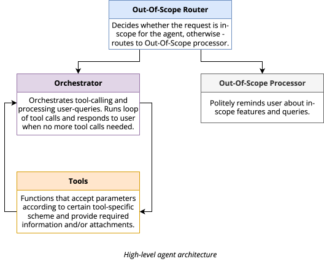
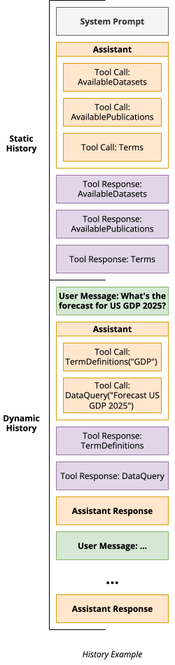
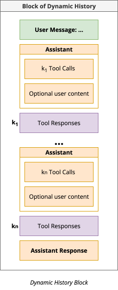

# StatGPT Agent

This document describes the design of the StatGPT agent.

## Idea

Previous iteration of StatGPT used an **LLM-as-router** approach to redirect user query to the corresponding "agent", e.g.
Data Query, General Question, Available Datasets. This approach is very limited and requires a lot of manual work to
maintain the routing and add new agents. Also, it is not flexible enough to handle complex queries, that require
interaction with multiple agents.

With latest LLMs development, the model were better trained to perform tool-calling, so we should use this ability to
implement a more flexible and powerful agent, that can handle more complex queries and interact with multiple tools.
New approach also potentially can simplify adding new tools to the system.

## Design

### Architecture

### History

History of the agent consists of two blocks: **static** and **dynamic**.

* **Static history** consists of:
  * **System Prompt** - contains instructions on language, tone, tool calling, domains, etc.
  * **Predefined Tool Calls** - tool calls that should be made regardless of the user query.
* **Dynamic history** consists of the blocks that have the following structure:
  * **User Query** - the query that user asked.
  * **Tool Calls** - tool calls that were made in response to the user query.
  * **Tool Responses** - responses from the tools.
  * **Agent Response** - the final response from the agent.

