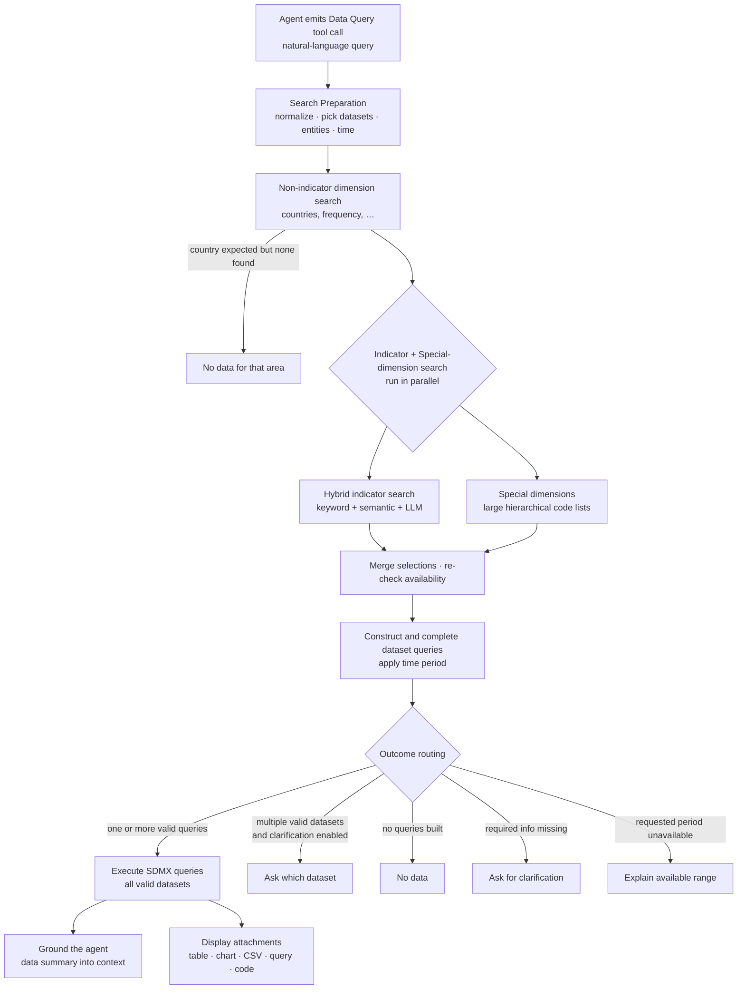
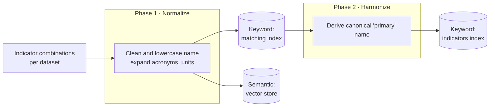
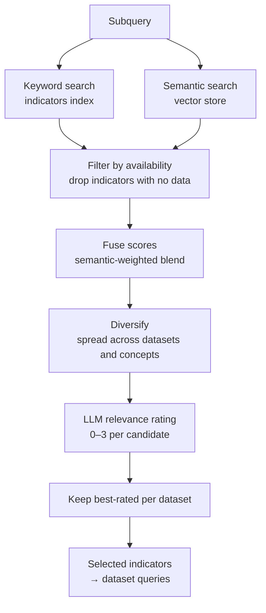

# 🔎 Data Query & Hybrid Indicator Search

This document explains, at a conceptual level, how StatGPT's **Data Query** tool turns a natural-language
request into a grounded SDMX data result — and how its **hybrid indicator search** finds the right statistical
indicators across many datasets by combining keyword search, semantic search, and LLM reasoning.

It is the conceptual companion to the engineering deep dive in
[**Data Query Internals**](./data-query-internals.md), which covers the same machinery at the component and
code level. If you are new to the platform, start here; if you are extending the pipeline, read this first and
then the internals doc.

> **Related reading:** [Agent Design](./agent.md) · [Tools](./tools.md) ·
> [SDMX Compatibility](./sdmx-compatibility.md) · Admin learning track:
> [Indicator Configuration](../learning/administration/03b-indicator-configuration.md),
> [Indexing & Operations](../learning/administration/06-indexing-and-operations.md).

---

## 1. Overview & Scope

### What the Data Query tool does

Data Query is one of the tools the StatGPT [agent](./agent.md) can call. It accepts a single natural-language
query (e.g. *"unemployment rate in Spain since 2015"*) and returns:

- an **agent-facing data summary** — the actual values, fed back into the agent's context so its answer is
  grounded in real data rather than hallucinated; and
- **user-facing attachments** — tables, charts, a downloadable CSV, the underlying SDMX query, and reusable
  Python code.

When a request cannot be answered cleanly, the tool returns a structured outcome instead — *no data*, *multiple
candidate datasets* (asking the agent to disambiguate), *missing required information*, or *time period out of
range* — so the agent can respond helpfully rather than guess.

### Why "hybrid"

The hardest part of answering a statistics question is finding **which indicator, in which dataset** the user
actually means. Three search strategies each cover a different failure mode, and StatGPT combines all three:

| Strategy | Strengths | Where it fails alone |
|----------|-----------|----------------------|
| **Keyword (lexical) search** | Exact terms, acronyms, codes, units | Misses paraphrases and synonyms ("jobless rate" vs "unemployment") |
| **Semantic (vector) search** | Synonyms, paraphrase, intent | Can drift toward "topically near but wrong"; weak on rare exact tokens |
| **LLM relevance reasoning** | Judges true relevance, handles composite indicators, prefers general vs specific appropriately | Too expensive to run over thousands of candidates directly |

Hybrid search uses keyword + semantic retrieval to produce a small, high-recall candidate set, then has an LLM
**judge** that set for relevance. This is more accurate than any single method and keeps LLM cost bounded.

### Audience & prerequisites

This document assumes basic familiarity with [SDMX](./sdmx-compatibility.md) (datasets, dimensions, code lists)
and the StatGPT [agent model](./agent.md). No code knowledge is required.

---

## 2. Key Concepts

A handful of terms recur throughout. Understanding them up front makes the rest of the document straightforward.

| Term | Meaning |
|------|---------|
| **Indicator (composite / virtual)** | There is **no single SDMX "indicator" dimension**. An administrator marks one or more code-list dimensions as `INDICATOR`. The *combination* of their values is what we call an indicator. So an "indicator" is a composite concept assembled from several SDMX dimensions, not a column you can point at. |
| **Dimension classes** | Every dataset dimension is classified as one of four types: **`INDICATOR`** (forms the composite indicator), **`NON_INDICATOR`** (ordinary filters such as *reference area / country* and *frequency*), **`TIME_PERIOD`**, or **`SPECIAL`** (large hierarchical code lists handled by a dedicated processor). |
| **Matching index vs Indicators index** | Two per-channel keyword (Elasticsearch) indices. The **matching index** holds the normalized name of every indicator. The **indicators index** (called the *"harmonized"* index in code) adds a canonical **primary** name on top. At query time, keyword search runs against the *indicators* index. |
| **Vector store** | A PostgreSQL + `pgvector` collection holding embeddings of indicator names. It powers the **semantic** half of hybrid search. |
| **Normalization vs Harmonization** | Two offline cleanup steps. **Normalization** rewrites an indicator name (expands acronyms, standardizes percent/currency wording, lowercases). **Harmonization** derives the canonical **primary** concept used for keyword matching. |
| **Fusion** | How keyword and semantic results are combined into one ranked list — a weighted blend of the two normalized scores, leaning toward the semantic side. |
| **Two score systems** | A **similarity score** (numeric, from fusion) decides *which* candidates reach the LLM and in what order. A separate **LLM relevance score** (an integer rating) decides which candidates are actually *kept*. Conflating these two is the most common source of confusion. |
| **Availability query** | An SDMX request that, given a partial selection, both narrows the valid values of chosen dimensions and lists available values for the others. StatGPT repeatedly intersects candidate selections with availability so the query it shows always matches the data it returns. |

---

## 3. End-to-End Flow

A Data Query call moves through five conceptual stages. The agent sees the data after **every** call; the user
sees attachments once, at the end of the turn.

| Stage | What happens |
|-------|--------------|
| **1. Search preparation** | The query is normalized (acronyms expanded), explicit dataset references are detected and stripped, named entities (countries, etc.) are extracted, and any time period is parsed. |
| **2. Non-indicator search** | Countries, frequency, and similar filters are resolved first, seeding the working selection and establishing which datasets are viable. |
| **3. Indicator + special-dimension search** | Hybrid indicator search and special-dimension (large code list) selection run in parallel; their results are merged into the working selection. |
| **4. Construction & routing** | Remaining dimensions are filled from defaults and availability, the time period is applied, and the result is routed to one of the outcomes below. |
| **5. Execution & output** | Valid queries are executed against the SDMX source; the data is summarized back to the agent and rendered as attachments for the user. |

### Outcome branches

| Outcome | When | What the user gets |
|---------|------|--------------------|
| ✅ **Execute** | At least one valid, complete query. **All** valid datasets are executed and returned together. | Data summary + attachments |
| ❓ **Multiple datasets** *(optional)* | More than one valid dataset **and** dataset clarification is enabled (a configurable channel option). | The agent is prompted to pick one dataset or ask the user. **When clarification is disabled, this step is skipped and every matching dataset is returned via Execute** — no forced choice. |
| ⚠️ **Incomplete** | No valid query could be built because a required dimension is unresolved | A clarification prompt with tables of available values |
| 📅 **Invalid time period** | No valid query, and a built query's requested period is outside the available range | The available range is explained |
| ❌ **No data** | No query could be built at all | A "no relevant data" message |

> Routing is ordered and the branches are mutually exclusive. The optional **Multiple datasets** clarification
> takes precedence when enabled; otherwise **Execute** handles one *or many* valid datasets. **Incomplete** and
> **Invalid time period** are only reached when there are no valid queries at all.

---

## 4. How Hybrid Indicator Search Works

Hybrid search has **two halves**: an offline **indexing** side that makes indicators searchable, and a runtime
**retrieval-and-selection** side that answers each query.

### 4.1 Indexing side (offline build)

When a dataset is indexed for a hybrid channel, StatGPT enumerates every available combination of the dataset's
`INDICATOR` dimensions — each combination becomes one indexable indicator — and runs a two-phase pipeline:

- **Phase 1 — Normalize.** Each indicator's name is cleaned by an LLM (acronyms expanded, percent/currency
  wording standardized) and lowercased. The normalized record is written to **both** the keyword *matching
  index* and the *vector store*. This is what makes every indicator simultaneously findable by exact wording
  and by meaning.
- **Phase 2 — Harmonize.** A canonical **primary** name is derived for each indicator — either by an LLM that
  inspects similar indicators across the channel, or structurally from the dimension names — and written to the
  keyword *indicators index*. The primary is the field keyword search matches against at runtime.

How the primary is derived is controlled per dataset by two administrator flags, `unpack` and `super_primary`
(see [§6](#6-configuration-at-a-glance) and the
[Indicator Configuration guide](../learning/administration/03b-indicator-configuration.md)).

> Indexing happens only for channels configured as **hybrid**. A *semantic* channel builds embeddings only (no
> keyword indices, no harmonization). Re-indexing is triggered automatically when an
> indexing-relevant part of the configuration changes; cosmetic changes do not trigger it. See
> [Indexing & Operations](../learning/administration/06-indexing-and-operations.md).

### 4.2 Runtime side (retrieval, fusion, selection)

For each query, the searcher first cleans the query text and splits it into independent **subqueries** (so
*"unemployment and inflation"* is handled as two indicator searches). Each subquery then runs this pipeline:

1. **Retrieve** the top candidates by keyword (against the indicators index) and by semantics (against the
   vector store), in parallel.
2. **Filter by availability** *before* combining — an indicator is dropped if its dataset or its specific
   value combination has no data for the already-chosen filters. Hybrid selection is therefore always gated by
   real data availability.
3. **Fuse** the two result sets into one ranked list using a weighted blend that leans toward the semantic
   side, so semantics drive recall while keyword scores refine the ordering.
4. **Diversify** the ranked list so no single dataset or concept monopolizes the candidate budget, with a
   safety net that re-includes the strongest candidates if diversification dropped them.
5. **Rate with an LLM.** The candidate list is shown to an LLM that scores each one for relevance on a **0–3**
   scale (0 = irrelevant, 3 = ideal). General questions are steered toward general indicators rather than
   overly specific ones.
6. **Select against a relevance threshold.** Only the best-rated indicators per dataset are kept, and a dataset
   is retained only if its best candidate reaches a configurable **minimum relevance score** —
   `single_dataset_score_threshold` / `multi_dataset_score_threshold` (default **2** on the 0–3 scale). A dataset
   whose best candidate scores below the threshold is dropped entirely. If **no** candidate in any dataset clears
   the bar, indicator search returns nothing — which on its own leads to a *no-data* outcome. The survivors
   become the indicator portion of the dataset query.

> **The two score systems again:** the numeric fusion score from step 3 only governs *which* candidates reach
> the LLM and their order. The integer **LLM relevance rating** from step 5 governs what is actually *kept*.
> They are independent.

### 4.3 Why this design

- **Semantic-anchored, keyword-refined** — semantics provide recall (catching paraphrase); keyword scores
  sharpen ranking (rewarding exact terms and units).
- **LLM as judge, not retriever** — the LLM never scans the whole index; it only rates a small, pre-filtered,
  diversified set, which keeps it both accurate and affordable.
- **Availability-gated** — because candidates are filtered against real availability before selection, the
  pipeline rarely proposes an indicator that turns out to have no data.

---

## 5. Dimensions & Availability

Selecting an indicator is only part of building a query. A complete SDMX query also pins the other dimensions.

- **Indicator dimensions** are resolved by hybrid search (above).
- **Non-indicator dimensions** — most importantly *reference area / country* and *frequency* — are resolved
  from the named entities found in the query, validated by an LLM, and (for countries) used to drop datasets
  that have no data for the requested area.
- **Special dimensions** are large hierarchical code lists (e.g. industry classifications) that are too big to
  index as indicators and too structured for entity extraction. A dedicated processor retrieves candidate codes
  and has an LLM pick the right ones.
- **Virtual dimensions** and **"all values"** let configuration inject a fixed value (e.g. a country for a
  national-agency dataset) or explicitly request every value of a dimension.

All of these streams produce the same currency — a per-dataset set of dimension selections — which is
repeatedly **intersected with availability** so the final query matches the data that actually exists. Any
dimensions still unset are filled from configured defaults (and, where the option set is small enough, by
auto-selecting all available values). If a *required* dimension cannot be resolved, the query is reported as
incomplete rather than executed.

See [SDMX Compatibility](./sdmx-compatibility.md) for how these selections map onto SDMX REST requests.

---

## 6. Configuration at a Glance

Hybrid search behavior is governed by configuration at three layers. Exact field names and current defaults
live in the code and the admin guides; this is the conceptual map.

| Layer | Controls | Examples |
|-------|----------|----------|
| **Channel** | Which search strategy is used, and how it is tuned | *index version* (semantic vs hybrid), *indicator selection version* (hybrid vs the LLM-only variants), fusion weights, candidate limits, relevance thresholds, special-dimension processors |
| **Dataset** | Which dimensions form the indicator and how names are harmonized | which dimensions are `INDICATOR` / `NON_INDICATOR` / `SPECIAL` / `TIME_PERIOD`, the country and frequency subtypes, required dimensions, defaults, and the `unpack` / `super_primary` harmonization flags |
| **Infrastructure** | The search backends | Elasticsearch connection (keyword indices), PostgreSQL + `pgvector` (vector store), the embedding model |

For administrator-facing guidance — how to choose `INDICATOR` dimensions, set `unpack`/`super_primary`, and run
indexing and deduplication — see the learning track:

- [Core Concepts](../learning/administration/01-core-concepts.md)
- [Dimension Types](../learning/administration/03a-dimension-types.md)
- [Indicator Configuration](../learning/administration/03b-indicator-configuration.md)
- [Indexing & Operations](../learning/administration/06-indexing-and-operations.md)

---

## 7. Where to Go Next

- **Implementation detail** — every component, control-flow path, and data structure described here is covered
  at the code level in [**Data Query Internals**](./data-query-internals.md).
- **Agent context** — how the Data Query tool is called and how its results are grounded into the conversation:
  [Agent Design](./agent.md) and [Tools](./tools.md).
- **Data layer** — what the platform expects from SDMX sources: [SDMX Compatibility](./sdmx-compatibility.md).
