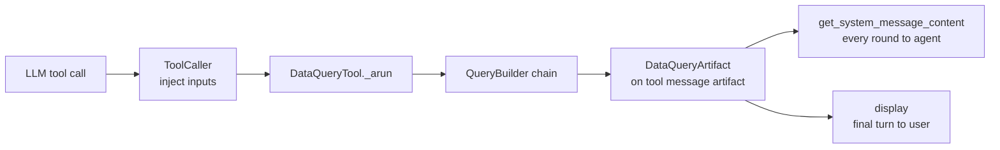
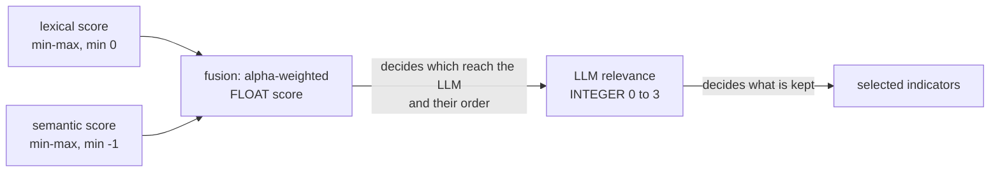
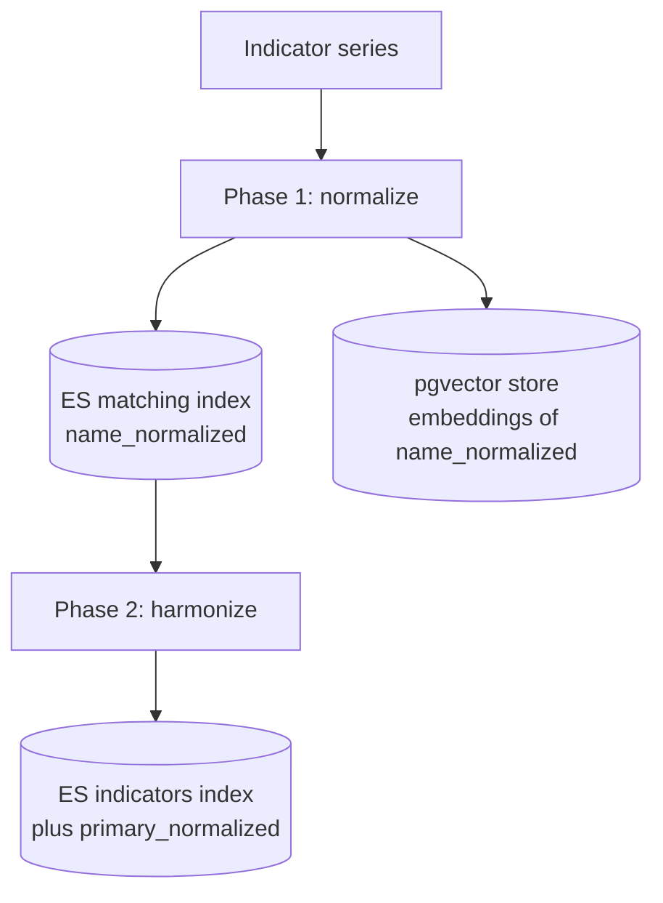
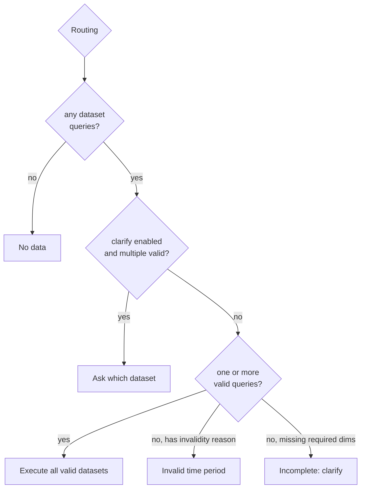

# 🛠️ Data Query Internals (Engineering Deep Dive)

This is the engineer-facing companion to [**Data Query & Hybrid Indicator Search**](./data-query-hybrid-search.md).
It maps the pipeline to concrete components, control flow, and data structures. Read the overview first for the
*why*; this document is the *how*.

It refers to the implementation by **component, class, and method names** rather than by line numbers, so it
stays useful as the code evolves. The navigation table below points at the relevant packages in the
[`statgpt-backend`](https://github.com/epam/statgpt-backend) repository (paths relative to the repo root); use
your editor's symbol search to jump to a named component.

> **Map:** [Agent Design](./agent.md) · [Tools](./tools.md) · [SDMX Compatibility](./sdmx-compatibility.md)

---

## 1. Orientation

### Where things live

| Concern | Package |
|---------|---------|
| Tool entry & agent integration | `statgpt/app/chains/data_query/`, `statgpt/app/chains/tools.py`, `statgpt/app/chains/supreme_agent.py` |
| Pipeline orchestration | `statgpt/app/chains/data_query/query_builder/` |
| Search preparation | `…/query_builder/misc/` |
| Dimension search & merge | `…/query_builder/dimensions/`, `…/query_builder/special_dimensions_selection/` |
| Indicator selection | `…/query_builder/indicator_selection/` |
| Runtime hybrid search engine | `statgpt/app/services/hybrid_searcher.py` |
| Offline hybrid indexer | `statgpt/common/hybrid_indexer/` |
| Vector store (pgvector) | `statgpt/common/vectorstore/` |
| Keyword index (Elasticsearch) | `statgpt/common/utils/elastic.py`, `statgpt/common/settings/elastic.py` |
| Finalize / construct / execute | `…/query_builder/query/`, `…/data_query/query_constructor/` |
| SDMX data layer | `statgpt/common/data/sdmx/`, `statgpt/common/data/base/query.py` |
| Config & data model | `statgpt/common/data/base/config.py`, `statgpt/common/schemas/data_query_tool.py`, `statgpt/common/models/models.py` |

### Key data structures

| Type | Role |
|------|------|
| `ChainState` | The dict-state threaded through every pipeline stage. |
| `DataSetAvailabilityQuery` / `DimensionQuery` / `Query` | Per-dataset `{dim_id → Query(values, operator)}`. The common currency of the whole pipeline; the operator is `IN` / `ALL` / a time operator. |
| `DataSetQuery` | An executable query carrying `is_valid` / `invalidity_reason`. |
| `ComplexIndicator` / `CodeIndicator` | The composite indicator — an ordered list of `(dimension, code)` values. |
| `MatchingIndex` / `IndicatorIndex` | Keyword index documents. `IndicatorIndex` adds `primary` / `primary_normalized` on top of `MatchingIndex`. |
| `DataQueryArtifact` | What the tool returns: `data_responses` + `state` + `eval_attachment`. |

### The threaded state

The pipeline is a LangChain (LCEL) composition over a single mutated dict, abstracted as `ChainState`. Stages
read keys written by earlier stages (`normalized_query`, `named_entities`, `strong_queries`,
`strong_availability`, …) and write their own. The most important working keys:

- `strong_queries` — the progressively built per-dataset selection.
- `strong_availability` — cached availability per dataset.
- `strong_queries_best_nonempty_attempt` — last non-empty snapshot, used for fallback messaging.

---

## 2. Tool Entry & Agent Integration

### Schema exposed to the LLM

`DataQueryArgs` defines a single LLM-visible field, `query: str`, with a description steering the model to send
one concise query per indicator while allowing multiple values for countries and other dimensions. The tool
**name and description** themselves are *not* hardcoded — they come from channel config via
`StatGptTool.from_config`; only the argument shape is fixed.

The cross-cutting execution context (`auth_context`, `choice`, `history`, `configuration`, target stage, and the
query) is passed as an injected `inputs` argument marked `InjectedToolArg`, so it is set in code by
`ToolCaller.call_tool` and stripped from the public schema — the LLM never sees it. `SupremeAgent` binds tools
with `model.bind_tools(..., strict=True)` so the provider enforces the argument schema.

### Execution

`DataQueryTool._arun` builds a `QueryBuilderFactory` from the tool config, sets the query input, invokes the
chain, then returns `(response_str, DataQueryArtifact)`. Because `StatGptTool` sets
`response_format='content_and_artifact'`, the returned artifact rides on the tool message's `artifact`.

### Two output channels

`DataQueryArtifactDisplayer` produces two distinct outputs from the merged `DataResponse`s:

- **Agent-facing** — `get_system_message_content` builds a TSV `<DATA>` block that is injected as a system
  message after **every** data-query round so the agent reasons over exact values. Columns are prefixed
  `DIMENSION:` / `ATTRIBUTE:`, coded values are split into `_ID`/`_Name`, and the block is capped (see
  `tool_response_max_cells` on `DataQueryDetails`); oversized or empty results emit a short message instead of
  the table.
- **User-facing** — `display` is called only on the **final** agent turn (no further tool calls) and uploads
  attachments: custom TTYD table, CSV, Plotly grid + per-indicator graphs, JSON query, and Python code.
  Per-type toggles live in `DataQueryAttachments`.

The loop itself (`SupremeAgentExecutor`) gathers tool calls concurrently, collects `DataQueryArtifact`s by tool
call id, injects the grounded system message after data-query rounds, and calls `display` once at the end.



---

## 3. Pipeline Orchestration

`QueryBuilderFactory` composes three sub-chains as an LCEL pipe:

```
search_preparation | dimensions_search | finalize_query
```

| Sub-chain | Factory | Role |
|-----------|---------|------|
| Search preparation | `SearchPreparationChainFactory` | Query understanding (§4) |
| Dimension search | `DimensionSearchChainFactory` | Resolve all dimensions (§5) |
| Finalize | `FinalizeQueryChainFactory` | Construct, time-filter, route, execute (§9) |

`set_tool_state` serializes the `QueryBuilderAgentState` and the debug eval attachment near the end of
finalization.

---

## 4. Search Preparation (Query Understanding)

`SearchPreparationChainFactory` sequences:

1. **Get available datasets** — the versioned dataset dict for the channel.
2. **Normalization** — `NormalizationChain` expands commonly-known acronyms (GDP, CPI) without expanding country
   groups into members, writing `normalized_query`.
3. **Dataset selection** — `DataSetsSelectionChain` detects explicit dataset references, maps the LLM's 1-based
   indexes to dataset UUIDs, and **overwrites** `normalized_query` with a dataset-reference-stripped rewrite. The
   pre-strip version is preserved as `normalized_query_raw`. Hallucination guards are double-layered: the LLM
   post-processor drops unknown indexes, and the apply step re-checks each id against the dataset dict.
4. **NER + datetime in parallel** — `NamedEntitiesChain` runs NER restricted to channel-configured entity types;
   `DateTimeDimensionChain` extracts temporal intent and start/end bounds. The datetime LLM must **not** infer
   missing bounds — post-processing fills them in code only for historical (end = today) / forecast
   (start = today) intents and clamps to the current period where flagged.
5. **Country entities** — the country-typed named entities (selected with a `startswith` heuristic flagged as a
   temporary workaround) are extracted for downstream country filtering.

`DateTimeQueryResponse.to_query` maps the parsed period to a `TIME_PERIOD` `DimensionQuery` (`BETWEEN`/`GTE`/
`LTE`), applied depending on `time_period_strategy` (§9).

> `GroupExpanderChain` for reference-area group expansion is **dormant**: its `create_chain` raises
> `NotImplementedError` and its call site is commented out.

---

## 5. Dimension Search & Merge

`DimensionSearchChainFactory` orchestrates dimension resolution. Shared helpers — concurrent availability fetch,
availability-based filtering, and best-attempt bookkeeping — live in `DimensionSearchChainFactoryBase`.

### Order of operations

1. **Non-indicator search runs first** to seed `strong_queries` and establish viable datasets.
   `NonIndicatorsSearchChainFactory`:
   - per non-`dataset` named entity, vector-searches non-indicator dimension values, scoped to the selected
     version ids;
   - augments with synthetic "All values" candidates;
   - validates with an LLM (`CandidatesSelectionSimpleChainFactory` → `SelectedCandidates`) and propagates the
     decision to de-duplicated candidates;
   - applies country filtering (GitHub issue #75): if any dataset got a country value, datasets lacking one are
     dropped; gated by `DataQueryDetails.filter_by_country_entities`.

2. **Routing** — if a country entity exists but no `strong_queries` survive, short-circuit to a
   "no data for {country}" message.

3. **Indicator + special dimensions in parallel** (`RunnableParallel`):
   - `IndicatorsSearchChainFactory` dispatches through `IndicatorSelectionFactory` (§6/§7), **overwrites**
     `strong_queries` with the selected indicator queries, then filters by required dimensions and by
     availability.
   - `SpecialDimensionsSearchChainFactory` runs the configured special-dimension processors — currently only
     `LHCLChainFactory` (Large Hierarchical Code Lists): vector retrieval of code candidates → grounded LLM
     selection (de-hallucinated) → per-dataset `DimensionQuery`.

4. **Merge & re-filter** — special-dimension `IN`-queries are folded into `strong_queries` (unioning values; an
   operator other than `IN` is rejected), then availability is recomputed and intersected again so displayed and
   executed queries stay consistent.

### Dimension model

`DimensionType` has exactly four values: `INDICATOR`, `NON_INDICATOR`, `TIME_PERIOD`, `SPECIAL`. Config
validators enforce ≥1 indicator dimension, exactly one time and one frequency dimension, at most one region
(country) dimension, and unique special processor ids.

- **The indicator is composite.** `Sdmx21DataSet` enumerates available combinations of `INDICATOR` dimensions
  into `ComplexIndicator`s. Selecting one yields per-real-dimension value queries.
- **Virtual dimensions** inject a fixed value and are **skipped** when building the SDMX key. **"All values"**
  maps a selected synthetic id to `QueryOperator.ALL`, which appends no filter for that dimension.
- **Availability is the narrowing core.** `DataSetAvailabilityQuery.filter` intersects only `IN`-operator
  dimensions; `ALL`/time operators pass through. Datasets whose availability is empty are dropped.

---

## 6. Indicator Selection Factory

`IndicatorSelectionFactory` dispatches on `DataQueryDetails.indicator_selection_version`. This document covers
the **hybrid** path (`IndicatorSelectionVersion.hybrid`); the semantic LLM-selection variants are out of scope
here.

The hybrid factory method resolves the two Elasticsearch indices via `ElasticSearchFactory` (the matching and
indicators index names are per-channel, derived on the `Channel` model), builds a `HybridSearcher` with the
channel's `HybridSearchConfig`, and wraps it in `IndicatorsSelectionHybrid`.

`IndicatorsSelectionHybrid` calls `HybridSearcher.search`, exposes four debug retrieval stages (lexical /
semantic / llm_scored / final), and in its finalization step deep-copies each per-dataset entry in
`strong_queries` and adds the selected indicator `DimensionQuery`s.

---

## 7. Runtime Hybrid Search Engine

`HybridSearcher` (in `statgpt/app/services/hybrid_searcher.py`) is the core engine; its inner `HybridMatch`
class runs the per-subquery pipeline. The three LLM prompts (`normalizationPrompt`, `separateSubjectsPrompt`,
`relevancyPrompt`) live in the hybrid-search prompt asset.

### Entry: `HybridSearcher.search`

1. Compute `version_ids` from the selected datasets and an availability map (`dataset_id → dim_id →
   set(values)`) from the strong-availability queries.
2. **Pre-match** — a lexical pre-match planner runs Elasticsearch highlighting plus a `primary` terms
   aggregation to find multi-token "good candidates" vs single-token ones, deduped via ES token analysis. These
   become protected "forbidden" phrases.
3. **Normalize input** — strips removable named entities (per `named_entities_to_remove`) and time text while
   protecting the forbidden phrases, and lowercases.
4. **Separate subjects** — split into independent indicator subqueries (so "unemployment and inflation" becomes
   two searches).
5. Run each subquery's `HybridMatch.search` concurrently (each with its own buffered DIAL stage to avoid
   interleaved output).

### Per-subquery: `HybridMatch.search`

| Step | Method | Notes |
|------|--------|-------|
| Query planner | `_query_planner` | Picks search parameters (fusion weight + candidate counts): fall back to near-pure semantic when there are no good lexical candidates; a more balanced blend when there are many. |
| Lexical | `_lexical` | Boolean query against the **indicators** index: *must* match `primary_normalized`, *should* match `name_normalized` (down-weighted), filtered by version. Min-max normalized against the result-set max. |
| Semantic | `_semantic_raw` / `_semantic_result` | `VectorStore.search_with_similarity_score` over pgvector, scoped by version; score = `1 − distance`. Min-max normalized. |
| Availability filter | `_filer_candidates_by_availability` | Applied to **both** sets **before** fusion: drop any candidate whose dataset is absent from availability, or whose series contains a `(dimension, value)` pair not in the availability set. |
| Fusion | `_hybrid_combination` / `_convex_combination` | **Not reciprocal rank fusion.** `score = alpha·semantic + (1−alpha)·lexical`; `alpha` weights the **semantic** side. The fused set is **anchored on semantic results** — it iterates the availability-filtered semantic docs, so a purely lexical hit with no semantic neighbor in the top-k never enters fusion (recall depends on the semantic candidate count). |
| Diversify | round-robin helpers | Round-robin across datasets and `primary_normalized` groups so no dataset/concept monopolizes the candidate budget; a safety net force-includes the global top-N if diversification dropped them. |
| LLM relevance | `_relevance_candidates` | Renumber, batch, render as a primary-grouped markdown tree (with a synthetic best-so-far item for cross-batch context), and call the relevancy chain. The rubric scores **0–3** (3 = ideal … 0 = irrelevant; general queries should prefer general indicators). |
| Select | `_filter_candidates` | The keep/drop decision uses the **integer LLM score**, not the fusion float. A candidate is kept iff its score equals its dataset's max (or the global max when `use_only_best_score`), and a dataset is admitted only if its best score meets the configured threshold. |

The survivors are collapsed into `dataset_id → dim_id → set(codes)`. Across subqueries, the per-dataset/dimension
sets are unioned into `DimensionQuery(operator=IN)`.

### The two score systems

This is the most important thing to internalize:



- **Float fusion score** — governs candidate *admission and ordering* into the LLM step only.
- **Integer LLM relevance score** — governs *final keep/drop*.

They are computed independently and serve different purposes. All tunables (the `alpha` variants, candidate
limits, batch size, score thresholds, `use_only_best_score`) are fields of `HybridSearchConfig`.

---

## 8. Offline Hybrid Indexer

`Indexer` (in `statgpt/common/hybrid_indexer/`) builds the searchable representation. It runs only for
**hybrid** channels (gated by `ChannelService.is_channel_hybrid`) and is driven as two background phases by the
admin dataset service. A *semantic* channel instead runs a plain embedding indexer (no Elasticsearch, no
harmonization).

### Series

The indexer builds an internal `_Series` — one `DimensionQuery` per `CodeIndicator`. The human-readable
indicator name joins component term names, **skipping** `ignored_term_ids` (default the SDMX "Not applicable"
code) so they don't pollute names — though those values are still recorded in the series' `where`. The series id
is deterministic, and the harmonized `IndicatorIndex` reuses it, giving a 1:1 mapping between the matching and
indicators documents. Series serialization persists only the first value of each `DimensionQuery`.

### Phase 1 — Normalize

An LLM cleans the name (expand acronyms, standardize percent/currency) and lowercases it into `name_normalized`.
A safe-invoke wrapper makes a single LLM failure fall back to a lowercased input rather than aborting the batch.
The `MatchingIndex` document is written to **both** the Elasticsearch matching index (upsert by id) and the
pgvector vector store (with `name_normalized` as the embedded content).

### Phase 2 — Harmonize

Derives a canonical `primary` and writes an `IndicatorIndex` (matching document + `primary` +
`primary_normalized`) to **only** the Elasticsearch indicators index. Two strategies, per the dataset's indexer
indicator config:

- `unpack=True` → hybrid-search similar normalized indicators across sibling versions (lexical Elasticsearch +
  semantic vector store, fused with the indexing-time `indexer_alpha`), round-robin diversified across datasets,
  then have the harmonize LLM extract the primary.
- `unpack=False` → derive the primary structurally from dimension names — the first dimension, or
  (`super_primary=True`) the first three concatenated.

> Harmonization uses **cross-dataset context**: the searched version set includes other datasets' latest
> completed versions so the unpack search can find similar indicators channel-wide.

### Index topology



Two Elasticsearch indices per channel plus the vector collection. At **runtime**, lexical search hits only the
*indicators* index; the *matching* index is used solely for token analysis; semantic search hits pgvector.

### Reindex lifecycle

An indexing hash (`compute_indexing_hash`) covers only the configuration fields marked as indexing-relevant
(dimension type, alias, virtual flag, special processor id, non-indicator subtype, and the `unpack`/
`super_primary` indexer flags). A change to one of those flips the dataset's status to needs-reindex;
display-only fields (`is_required`, `default_queries`, `all_values`, citation, …) apply silently. The
`ChannelDatasetVersion` model stores the hashes and indexing stats. Operationally this is driven from the CLI:
`channel reindex`, `channel deduplicate`, and `channel status`.

---

## 9. Availability, Construction & Execution

`FinalizeQueryChainFactory` turns the merged selections into executable queries and routes the outcome.

### Construction

Empty `strong_queries` are dropped; for each remaining dataset, `QueryConstructorFactory` returns a
`CompositeQueryConstructor` wrapping `[Simple, Iterative]`:

- `SimpleQueryConstructor` fills missing dimensions from default queries / available values in one pass.
- `IterativeQueryConstructor` re-runs availability after each default/time assignment (because narrowing one
  dimension changes what's available for others).
- `CompositeQueryConstructor` returns the first valid query with non-empty availability; it falls through from
  Simple to Iterative on a valid-but-empty-availability result.

When a dimension without defaults has a small enough option set it is auto-selected (operator `ALL`); above the
threshold the query is left incomplete. These thresholds are constructor constants.

### Time period

`time_period_strategy` (`BEFORE` vs `AFTER`) decides when time is applied. Under `AFTER`, a post-construction
filter re-runs availability and either applies the selected period (marking queries `INVALID_TIME_PERIOD` when
outside the available range, recording the offending field/value and the available bounds) or the dataset
default. A time-range expander snaps bounds to frequency-aligned period start/end.

### Routing

Routing is **ordered and mutually exclusive**:

| Order | Branch | Class | Condition |
|-------|--------|-------|-----------|
| 1 | No data | `NoDataChain` | No dataset queries at all. |
| 2 | Multiple datasets *(optional)* | `MultipleDatasetsChain` | `clarify_if_multiple_datasets` is enabled **and** more than one valid query exists. The agent is asked to pick one dataset or ask the user. |
| 3 | Execute | `ExecuteQueryChain` | One **or more** valid queries. When clarification is disabled, this branch executes **all** valid datasets together — there is no forced dataset choice. |
| 4 | Invalid time period | `InvalidSelectedTimePeriodChain` | No valid query, but at least one carries an `invalidity_reason`. |
| 5 | Incomplete | `IncompleteQueriesChain` | No valid query, due to unresolved required dimensions; emits a clarification with tables of available values. |

Because the Execute branch catches "one or more valid queries", branches 4 and 5 are only reached when there are
**zero** valid queries. The Multiple-datasets clarification is the *only* thing that diverts multiple valid
datasets away from a single combined execution, and it is opt-in via `clarify_if_multiple_datasets`.



### Execution

`ExecuteQueryChain` runs the data query per dataset concurrently. `Sdmx21DataSet.query` builds the SDMX REST key
(DSD dimension order, values joined by `+`, dimensions by `.`; time via `startPeriod`/`endPeriod`), fetches the
data message, parses to a pandas dataframe, and returns an `Sdmx21DataResponse` with request/parsing status
(failures are captured, not raised). `availability_query` issues the SDMX `availableconstraint` call
(rate-limited) and parses the result back into a `DataSetAvailabilityQuery`; the SDMX 3.0 proxy reuses the same
parsing path. `SummarizeQueriesChain` adds per-query summaries before the response text is finalized.

---

## 10. Outputs & Artifacts

Covered structurally in §2. The data path, end to end:

- The tool returns `DataQueryArtifact{data_responses, state, eval_attachment}` on the tool message artifact.
- Responses are merged per dataset via `DataResponse.merge`; the status merge combines request statuses (both
  SUCCESS → SUCCESS, both FAILED → FAILED, otherwise PARTIALLY_FAILED), and a partial parse prepends a disclaimer
  in the agent TSV.
- User attachments derive from `DataResponse`: a visual dataframe (time unstacked to columns), a CSV dataframe, a
  custom TTYD table, a Plotly grid plus per-indicator graphs, the JSON query, and generated Python code
  (per-dataset, or merged into one file when configured).
- The debug eval attachment (the retrieval stages) is surfaced as a downloadable JSON only when debug
  attachments are enabled.

---

## 11. Configuration Reference

Knobs by layer, named by their config class so you can look up current fields and defaults in code.

| Layer | Class | Selected fields |
|-------|-------|-----------------|
| **Channel — tool** | `DataQueryDetails` | `indexer_version`, `indicator_selection_version`, `time_period_strategy`, `clarify_if_multiple_datasets`, `filter_by_country_entities`, `candidates_per_entity`, `tool_response_max_cells`, `attachments`, `messages`, `prompts`, `llm_models` |
| **Channel — hybrid** | `HybridSearchConfig` | fusion weights (`*_alpha`), candidate limits (lexical / semantic / pre-match / `max_candidates`), `batch_size`, score thresholds, `use_only_best_score`, `named_entities_to_remove`, `indexer_alpha`, `ignored_term_ids`, normalize/harmonize model configs |
| **Channel — special dims** | `DataQueryDetails.special_dimensions_processors` | per-processor `id`, `type` (LHCL), `top_k`, `prompt`, `llm_model_config` |
| **Dataset — dimensions** | `DataSetConfig` / `BaseDimensionConfig` | `dimension_type`, `subtype` (REGION / FREQUENCY), `alias`, `is_required`, `virtual`, `all_values`, `default_queries`, `processor_id` |
| **Dataset — indexer** | `IndexerConfig` / `IndexerIndicatorConfig` | `unpack`, `super_primary`, `annotations` |
| **Infrastructure** | `ElasticSearchSettings`, `PostgresSettings`, `LangChainSettings` | Elasticsearch (keyword indices + analyzers), PostgreSQL + pgvector (vector store), the embedding model |
| **Runtime flags** | `StateVarsConfig` | `SHOW_DEBUG_STAGES`, `CMD_SKIP_TOOLS_EXECUTION`, `CMD_SKIP_DATA_QUERY_SUMMARIZATION` |

---

## See Also

- [Data Query & Hybrid Indicator Search](./data-query-hybrid-search.md) — the conceptual overview.
- [Agent Design](./agent.md) · [Tools](./tools.md) · [SDMX Compatibility](./sdmx-compatibility.md)
- Admin learning track: [Indicator Configuration](../learning/administration/03b-indicator-configuration.md),
  [Indexing & Operations](../learning/administration/06-indexing-and-operations.md).
