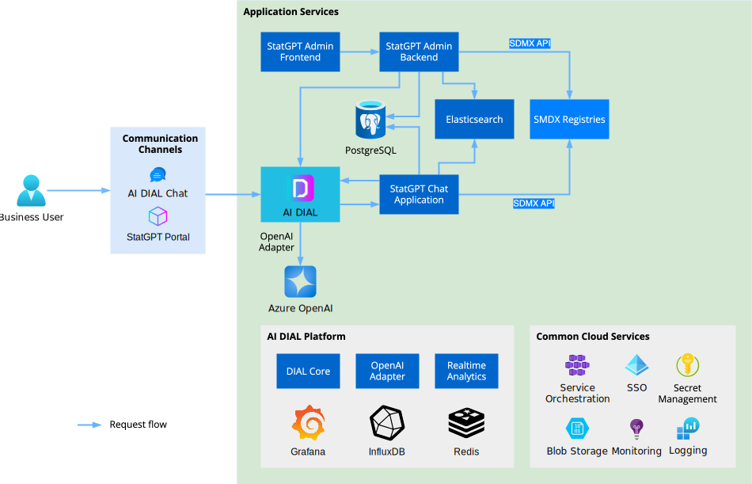

# StatGPT Services & Dependencies Overview

This document provides a comprehensive overview of the core services and dependencies in the StatGPT architecture,
detailing their roles, interactions, and technical implementations.

## 🗺️ Architecture Diagram

## 🔗 Third-Party Dependencies

### AI DIAL Platform

**Role**: Core platform providing essential services

**Key Capabilities**:

- User management and authentication
- Usage monitoring and rate limiting
- AI model integration and orchestration
- File storage and management

📖 For detailed information, see [AI DIAL Documentation](https://docs.dialx.ai/)

### ElasticSearch

**Role**: Search and indexing engine

**Key Features**:

- Large-scale dataset indexing
- Hybrid search capabilities
- Keyword and semantic search support

### PostgreSQL with pgvector

**Role**: Primary database with vector capabilities

**Key Features**:

- Structured data storage
- Vector data handling via pgvector extension
- Semantic search and similarity matching
- Configuration and metadata storage

## 🏭 Core Services

### 💬 StatGPT Chat Backend

#### Technology Stack

**Base**: DIAL Application built with [AI DIAL Python SDK](https://github.com/epam/ai-dial-sdk)

**Core Frameworks**:

| Framework                                                    | Purpose                                     |
|--------------------------------------------------------------|---------------------------------------------|  
| [FastAPI](https://fastapi.tiangolo.com/)                     | Web framework for API development           |
| [SQLAlchemy](https://www.sqlalchemy.org/)                    | ORM for database operations                 |
| [LangChain](https://python.langchain.com/docs/introduction/) | LLM application framework                   |
| [Pydantic](https://pydantic.dev/)                            | Data validation and settings                |
| [sdmx1](https://github.com/khaeru/sdmx)                      | SDMX data handling and provider connections |

#### Overview

**Primary Function**: Expose REST API compliant
with [DIAL API Specification](https://dialx.ai/dial_api#operation/sendChatCompletionRequest)

**Integration**: Configured in DIAL Core for access via:

- REST API
- DIAL Chat UI
- StatGPT Portal

**DIAL Platform Services**:

-

🔐 [Authentication & Authorization](https://docs.dialx.ai/platform/architecture-and-concepts/components#authentication-and-authorization)
-
📊 [Rate Limits & Cost Control](https://docs.dialx.ai/platform/architecture-and-concepts/components#rate-limits--cost-control)

- 📁 [File Attachment Storage](https://docs.dialx.ai/platform/architecture-and-concepts/components#persistent-layer)

#### Dependencies

| Service                   | Purpose                                              |
|---------------------------|------------------------------------------------------|  
| **AI DIAL**               | Platform services and model access                   |
| **PostgreSQL + pgvector** | Data storage and vector operations                   |
| **ElasticSearch**         | Search and indexing                                  |
| **External AI Models**    | LLM capabilities (e.g., Azure OpenAI)                |
| **SDMX Providers**        | Statistical data sources (IMF, World Bank, Eurostat) |

### ⚙️ StatGPT Admin Backend

#### Technology Stack

**Type**: Standalone service

**Core Frameworks**:

| Framework                                            | Purpose                            |
|------------------------------------------------------|------------------------------------|  
| [FastAPI](https://fastapi.tiangolo.com/)             | Web framework for API development  |
| [SQLAlchemy](https://www.sqlalchemy.org/)            | ORM for database operations        |
| [Alembic](https://alembic.sqlalchemy.org/en/latest/) | Database migration management      |
| [Pydantic](https://pydantic.dev/)                    | Data validation and settings       |
| [sdmx1](https://github.com/khaeru/sdmx)              | SDMX data and provider connections |

#### Overview

**Primary Function**: REST API for administrative operations

**Key Responsibilities**:

- Configuration management (channels, datasets, glossary)
- Dataset indexing and processing
- Content control and access management

#### Authentication & Authorization

**Protocol**: [OAuth2](https://oauth.net/2/) with [OpenID Connect](https://openid.net/connect/)

**Supported Providers**:

- Azure Entra ID (formerly Azure AD)
- Keycloak
- Other OIDC-compliant providers

**Access Control**: Configurable role/group-based permissions

#### Dependencies

| Service                   | Purpose                                     |
|---------------------------|---------------------------------------------|  
| **PostgreSQL + pgvector** | Configuration and metadata storage          |
| **SDMX Providers**        | Dataset sources (IMF, World Bank, Eurostat) |
| **Identity Provider**     | Authentication (Azure Entra ID, Keycloak)   |
| **AI DIAL**               | Content storage (files, archives)           |
| **External AI Models**    | Dataset indexing (e.g., Azure OpenAI)       |

### 🕹️ StatGPT Admin Frontend

#### Technology Stack

**Type**: Single Page Application (SPA)

**Frameworks & Libraries**:

| Technology                                    | Purpose                     |
|-----------------------------------------------|-----------------------------|  
| [React](https://react.dev/)                   | UI component framework      |
| [Next.js](https://nextjs.org/)                | React application framework |
| [NextAuth.js](https://next-auth.js.org/)      | Authentication management   |
| [TypeScript](https://www.typescriptlang.org/) | Type-safe JavaScript        |

#### Overview

**Primary Function**: Administrative user interface

**Key Features**:

- Configuration management UI
- Dataset indexing controls
- Content management interface
- REST API integration with Admin Backend

#### Authentication & Authorization

**Framework**: [NextAuth.js](https://next-auth.js.org/)

**Supported Providers**:

- Azure Entra ID (formerly Azure AD)
- Keycloak
- Other OAuth2/OIDC providers

#### Dependencies

| Service                   | Purpose                          |
|---------------------------|----------------------------------|  
| **StatGPT Admin Backend** | API services and data management |
| **Identity Provider**     | User authentication              |

### 🌐 StatGPT Portal Frontend

#### Technology Stack

**Type**: Single Page Application (SPA)

**Frameworks & Libraries**:

| Technology                                    | Purpose                     |
|-----------------------------------------------|-----------------------------|  
| [React](https://react.dev/)                   | UI component framework      |
| [Next.js](https://nextjs.org/)                | React application framework |
| [NextAuth.js](https://next-auth.js.org/)      | Authentication management   |
| [TypeScript](https://www.typescriptlang.org/) | Type-safe JavaScript        |

#### Overview

**Primary Function**: End-user interface for StatGPT interactions

**Purpose**: Advanced replacement for default DIAL Chat UI with StatGPT-specific features

**Key Capabilities**:

- 💬 Create and manage StatGPT conversations
- 📊 View data visualizations and charts
- 🔍 Query datasets with Advanced View editor
- 🤝 Share conversations between users

#### Authentication & Authorization

**Framework**: [NextAuth.js](https://next-auth.js.org/)

**Supported Providers**:

- Azure Entra ID (formerly Azure AD)
- Azure B2C
- Keycloak
- Other OAuth2/OIDC providers

#### Dependencies

| Service                  | Purpose                                               |
|--------------------------|-------------------------------------------------------|  
| **DIAL Platform**        | Authentication, rate limits, file storage, API access |
| **StatGPT Chat Backend** | Core chat and data query services                     |
| **Identity Provider**    | User authentication and SSO                           |
| **SDMX Providers**       | Direct metadata and data queries                      |

