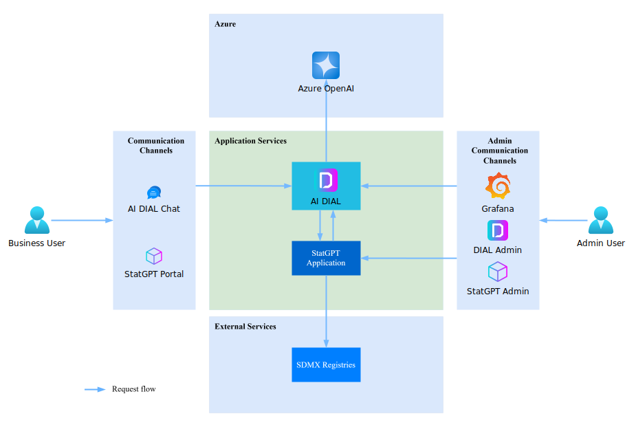

# StatGPT Services & Dependencies Overview

This document provides a comprehensive overview of the core services and dependencies in the StatGPT architecture,
detailing their roles, interactions, and technical implementations.

## 🗺️ High-Level Architecture

## Detailed Architecture

## 🔗 Third-Party Dependencies

### AI DIAL Platform

**Role**: Core platform providing essential services

**Key Capabilities**:

- User management and authentication
- Usage monitoring and rate limiting
- AI model integration and orchestration
- File storage and management

📖 For detailed information, see [AI DIAL Documentation](https://docs.dialx.ai/)

### ElasticSearch

**Role**: Search and indexing engine

**Key Features**:

- Large-scale dataset indexing
- Hybrid search capabilities
- Keyword and semantic search support

### PostgreSQL with pgvector

**Role**: Primary database with vector capabilities

**Key Features**:

- Structured data storage
- Vector data handling via pgvector extension
- Semantic search and similarity matching
- Configuration and metadata storage

## 🏭 Core Services

### 💬 StatGPT Chat Backend

#### Technology Stack

**Base**: DIAL Application built with [AI DIAL Python SDK](https://github.com/epam/ai-dial-sdk)

**Core Frameworks**:

| Framework                                                    | Purpose                                     |
|--------------------------------------------------------------|---------------------------------------------|
| [FastAPI](https://fastapi.tiangolo.com/)                     | Web framework for API development           |
| [SQLAlchemy](https://www.sqlalchemy.org/)                    | ORM for database operations                 |
| [LangChain](https://python.langchain.com/docs/introduction/) | LLM application framework                   |
| [Pydantic](https://pydantic.dev/)                            | Data validation and settings                |
| [sdmx1](https://github.com/khaeru/sdmx)                      | SDMX data handling and provider connections |

#### Overview

**Primary Function**: Expose REST API compliant
with [DIAL API Specification](https://dialx.ai/dial_api#operation/sendChatCompletionRequest)

**Integration**: Configured in DIAL Core for access via:

- REST API
- DIAL Chat UI
- StatGPT Portal

**DIAL Platform Services**:

-

🔐 [Authentication & Authorization](https://docs.dialx.ai/platform/architecture-and-concepts/components#authentication-and-authorization)
-
📊 [Rate Limits & Cost Control](https://docs.dialx.ai/platform/architecture-and-concepts/components#rate-limits--cost-control)

- 📁 [File Attachment Storage](https://docs.dialx.ai/platform/architecture-and-concepts/components#persistent-layer)

#### Dependencies

| Service                   | Purpose                                                                     |
|---------------------------|-----------------------------------------------------------------------------|
| **AI DIAL**               | Platform services and model access                                          |
| **PostgreSQL + pgvector** | Data storage and vector operations                                          |
| **ElasticSearch**         | Search and indexing                                                         |
| **External AI Models**    | LLM capabilities (e.g., Azure OpenAI)                                       |
| **StatGPT SDMX Proxy**    | Unified SDMX 3.0 facade in front of upstream SDMX registries (IMF, BIS, …). |

#### MCP Endpoint

The Chat Backend exposes channel tools over the [Model Context Protocol](https://modelcontextprotocol.io/) at
`POST /api/v1/{deployment_id}/mcp`, fronted by AI DIAL as the `mcpEndpoint` of a DIAL Application. DIAL handles
MCP-spec authorization-server discovery and forwards the user's credentials to the endpoint, so AI agents can
invoke channel tools inside their own reasoning loops.

→ See [Application MCP](./mcp.md) for the tools catalog and request flow.

### ⚙️ StatGPT Admin Backend

#### Technology Stack

**Type**: Standalone service

**Core Frameworks**:

| Framework                                            | Purpose                            |
|------------------------------------------------------|------------------------------------|
| [FastAPI](https://fastapi.tiangolo.com/)             | Web framework for API development  |
| [SQLAlchemy](https://www.sqlalchemy.org/)            | ORM for database operations        |
| [Alembic](https://alembic.sqlalchemy.org/en/latest/) | Database migration management      |
| [Pydantic](https://pydantic.dev/)                    | Data validation and settings       |
| [sdmx1](https://github.com/khaeru/sdmx)              | SDMX data and provider connections |

#### Overview

**Primary Function**: REST API for administrative operations

**Key Responsibilities**:

- Configuration management (channels, datasets, glossary)
- Dataset indexing and processing
- Content control and access management

#### Authentication & Authorization

**Protocol**: [OAuth2](https://oauth.net/2/) with [OpenID Connect](https://openid.net/connect/)

**Supported Providers**:

- Azure Entra ID (formerly Azure AD)
- Keycloak
- Other OIDC-compliant providers

**Access Control**: Configurable role/group-based permissions

#### Dependencies

| Service                   | Purpose                                     |
|---------------------------|---------------------------------------------|
| **PostgreSQL + pgvector** | Configuration and metadata storage                                                                                                                |
| **StatGPT SDMX Proxy**    | Unified SDMX 3.0 facade in front of upstream SDMX registries (IMF, BIS, …). Admin Backend reads metadata for dataset onboarding through the proxy. |
| **Identity Provider**     | Authentication (Azure Entra ID, Keycloak)                                                                                                         |
| **AI DIAL**               | Content storage (files, archives)                                                                                                                 |
| **External AI Models**    | Dataset indexing (e.g., Azure OpenAI)                                                                                                             |

### 🔁 StatGPT SDMX Proxy

#### Technology Stack

**Type**: Standalone Spring Boot service ([repository](https://github.com/epam/statgpt-sdmx-proxy))

**Core Frameworks**:

| Framework                                                         | Purpose                                          |
|-------------------------------------------------------------------|--------------------------------------------------|
| [Spring Boot 4.0](https://spring.io/projects/spring-boot)         | Application framework                            |
| [OpenFeign](https://github.com/OpenFeign/feign)                   | Declarative HTTP clients for upstream registries |
| [Resilience4j](https://resilience4j.readme.io/)                   | Circuit breaker, retry, rate limiting            |
| [Spring Data Redis](https://spring.io/projects/spring-data-redis) | Distributed caching backend                      |
| [OpenTelemetry](https://opentelemetry.io/)                        | Observability (traces, metrics, logs)            |

#### Overview

**Primary Function**: Expose a single, unified
[SDMX 3.0 REST API](https://github.com/sdmx-twg/sdmx-rest/tree/master/doc) in front of multiple upstream SDMX
registries (IMF, BIS, …) so that StatGPT components are decoupled from per-registry version, format, auth, and
quirk differences.

**Key Responsibilities**:

- Protocol translation between SDMX 2.1 and SDMX 3.0
- Format conversion across SDMX-JSON, SDMX-ML (XML), and SDMX-CSV
- Agency-based routing (including sub-agency wildcarding and synthetic AgencyScheme discovery)
- Caching, circuit breaking, retries, rate limiting, and per-registry response patching
- Configuration-driven onboarding of new registries (no code change required)

#### Authentication & Authorization

**Outbound** (to upstream SDMX registries): currently the proxy does not send credentials to upstream registries.

**Inbound**: the proxy itself is not directly exposed to the internet. External traffic reaches it through DIAL
Core, which is responsible for authorizing requests. StatGPT backends call the proxy over the internal cluster
network.

#### Dependencies

| Service              | Purpose                                                                                                |
|----------------------|--------------------------------------------------------------------------------------------------------|
| **SDMX Registries**  | Upstream statistical data sources (IMF, BIS, and any registry added via configuration)                 |
| **Redis** (optional) | Distributed cache (`CACHE_MODE=REDIS`). Falls back to in-memory Caffeine when unavailable.             |
| **Config Server** (optional) | `sdmx-proxy-config-server` module — runtime-managed registry configuration when the bundled defaults aren't enough. |

### 🕹️ StatGPT Admin Frontend

#### Technology Stack

**Type**: Single Page Application (SPA)

**Frameworks & Libraries**:

| Technology                                    | Purpose                     |
|-----------------------------------------------|-----------------------------|
| [React](https://react.dev/)                   | UI component framework      |
| [Next.js](https://nextjs.org/)                | React application framework |
| [NextAuth.js](https://next-auth.js.org/)      | Authentication management   |
| [TypeScript](https://www.typescriptlang.org/) | Type-safe JavaScript        |

#### Overview

**Primary Function**: Administrative user interface

**Key Features**:

- Configuration management UI
- Dataset indexing controls
- Content management interface
- REST API integration with Admin Backend

#### Authentication & Authorization

**Framework**: [NextAuth.js](https://next-auth.js.org/)

**Supported Providers**:

- Azure Entra ID (formerly Azure AD)
- Keycloak
- Other OAuth2/OIDC providers

#### Dependencies

| Service                   | Purpose                          |
|---------------------------|----------------------------------|
| **StatGPT Admin Backend** | API services and data management |
| **Identity Provider**     | User authentication              |

### 🌐 StatGPT Portal Frontend

#### Technology Stack

**Type**: Single Page Application (SPA)

**Frameworks & Libraries**:

| Technology                                    | Purpose                     |
|-----------------------------------------------|-----------------------------|
| [React](https://react.dev/)                   | UI component framework      |
| [Next.js](https://nextjs.org/)                | React application framework |
| [NextAuth.js](https://next-auth.js.org/)      | Authentication management   |
| [TypeScript](https://www.typescriptlang.org/) | Type-safe JavaScript        |

#### Overview

**Primary Function**: End-user interface for StatGPT interactions

**Purpose**: Advanced replacement for default DIAL Chat UI with StatGPT-specific features

**Key Capabilities**:

- 💬 Create and manage StatGPT conversations
- 📊 View data visualizations and charts
- 🔍 Query datasets with Advanced View editor
- 🤝 Share conversations between users

#### Authentication & Authorization

**Framework**: [NextAuth.js](https://next-auth.js.org/)

**Supported Providers**:

- Azure Entra ID (formerly Azure AD)
- Azure B2C
- Keycloak
- Other OAuth2/OIDC providers

#### Dependencies

| Service                  | Purpose                                               |
|--------------------------|-------------------------------------------------------|
| **DIAL Platform**        | Authentication, rate limits, file storage, API access                                                                              |
| **StatGPT Chat Backend** | Core chat and data query services                                                                                                  |
| **Identity Provider**    | User authentication and SSO                                                                                                        |
| **StatGPT SDMX Proxy**   | Metadata and data queries from the Advanced View editor — Portal does not call upstream SDMX registries directly.                  |
