# Administrator Guide

This document covers the StatGPT Admin Frontend — its features, screens, and the StatGPT configurations you manage
through it: **data sources**, **datasets**, and **channels**.

> Screenshots in this guide are taken from the built-in **StatGPT Sample** channel and its IMF sample resources.
> Numbered badges in each screenshot correspond to the numbered steps in the surrounding text.

## Table of Contents

- [Administrator App](#administrator-app)
- [Concepts](#concepts)
- [Data Sources](#data-sources)
  - [Browsing data sources](#browsing-data-sources)
  - [Adding a data source](#adding-a-data-source)
  - [Editing a data source](#editing-a-data-source)
- [Datasets](#datasets)
  - [Browsing datasets](#browsing-datasets)
  - [Adding a dataset](#adding-a-dataset)
  - [Editing a dataset](#editing-a-dataset)
- [Channels](#channels)
  - [Browsing channels](#browsing-channels)
  - [Configuring a channel](#configuring-a-channel)
  - [The channel datasets page](#the-channel-datasets-page)
    - [Per-dataset actions](#per-dataset-actions)
    - [Versions](#versions)
    - [Auto update jobs](#auto-update-jobs)
    - [Indexing operations](#indexing-operations)
  - [Glossary of Terms](#glossary-of-terms)
  - [Import / Export & Jobs](#import--export--jobs)
- [Audit Logs](#audit-logs)
- [Related resources](#related-resources)

## Administrator App

StatGPT Admin is an application that focuses solely on managing StatGPT configurations, including data sources,
datasets, and channels. The application does not cover user management, authentication, authorization, monitoring, or
cost control, which are handled by the DIAL platform. More information on this topic can be found in the
[architecture overview article](../architecture/overview.md#-core-requirements).

The left-hand navigation gives access to the main sections:

- **Data Sources** — SDMX endpoints StatGPT can read from.
- **Datasets** — individual dataflows onboarded from those sources, with StatGPT-specific configuration.
- **Documents** — publication/RAG content (outside the scope of this guide).
- **Channels** — end-user StatGPT applications, each with its own datasets, glossary, index, and agent configuration.
- **Audit Logs** — a chronological record of configuration changes.

## Concepts

StatGPT uses several key concepts that are referenced throughout this document:

1. **Data Source** — A source of data that can be queried using the SDMX protocol. Examples include IMF, Eurostat,
   World Bank, etc. Each data source has a **connector** that determines how StatGPT talks to it
   (`SDMX21`, `QH_SDMX21`, or `PROXY_SDMX30`).
2. **Dataset** — A direct representation of an SDMX dataflow in a data source, plus StatGPT-specific configuration
   (dimension roles, default queries, indexing options, citation, etc.).
3. **Channel** — A representation of the StatGPT application for end users. Each channel has its own configuration,
   datasets, and index. Having multiple channels allows experimentation with different LLM / index / dataset
   configurations. Each channel is exposed as a separate DIAL Application.
4. **Index version** — Each dataset, *within a channel*, is indexed as an immutable **version**. A new version is
   created whenever the dataset configuration changes, a manual reindex is triggered, or a channel is imported from a
   zip. The channel always serves data from the latest **completed** version.
5. **Auto-update** — When enabled, StatGPT periodically checks the source for new data and, if something changed,
   builds a fresh index version automatically (see [Auto update jobs](#auto-update-jobs)).

> **Tip — going deeper on dataset onboarding.** This guide focuses on the Admin UI. For a field-by-field methodology
> (assessing datasets, classifying dimensions, configuring indicators, indexing, and validation), follow the
> [Admin Learning Course](../learning/administration/README.md).

---

## Data Sources

### Browsing data sources

The **Data Sources** screen lists every configured source. Use the column filters to narrow the list.

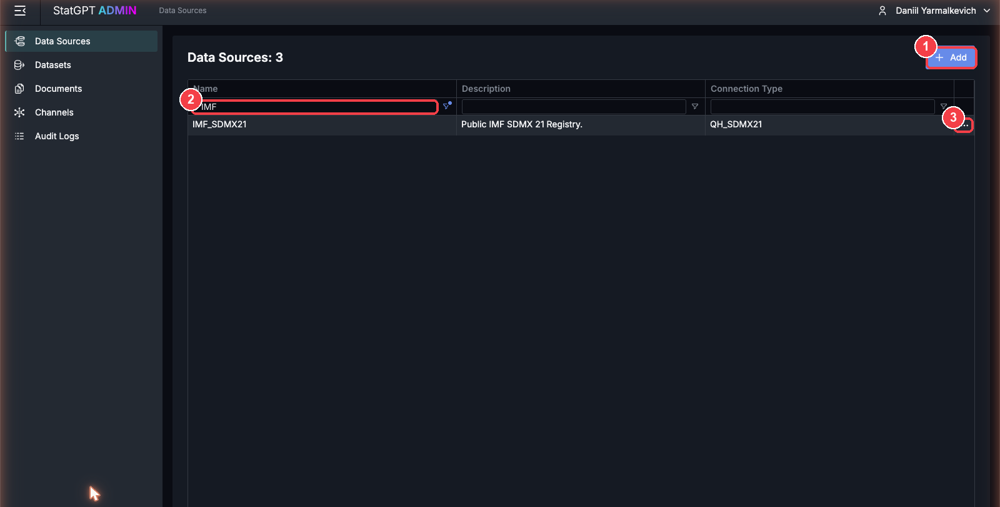

1. **+ Add** — start the *Add Data Source* wizard.
2. **Column filters** — filter by Name, Description, or Connection Type.
3. **Row menu (⋯)** — **Configure** or **Delete** an existing source.

### Adding a data source

Adding a source is a two-step wizard.

**Step 1 — Properties.**

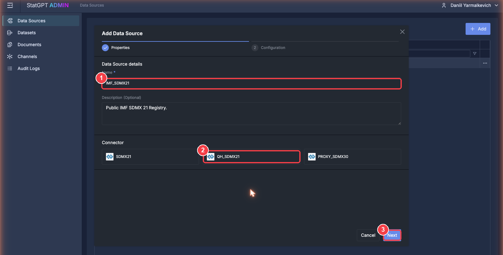

1. **Name** — a unique identifier for the source (e.g. `IMF_SDMX21`). An optional description can be added below.
2. **Connector** — choose how StatGPT connects to the registry:
   - `SDMX21` — a standard SDMX 2.1 REST endpoint.
   - `QH_SDMX21` — an SDMX 2.1 endpoint served through QuantHub (used by the IMF sample).
   - `PROXY_SDMX30` — an SDMX 3.0 source accessed through the StatGPT SDMX Proxy.
3. **Next** — continue to the configuration editor.

**Step 2 — Configuration.** Provide the connector configuration as YAML, then click **Finish**.

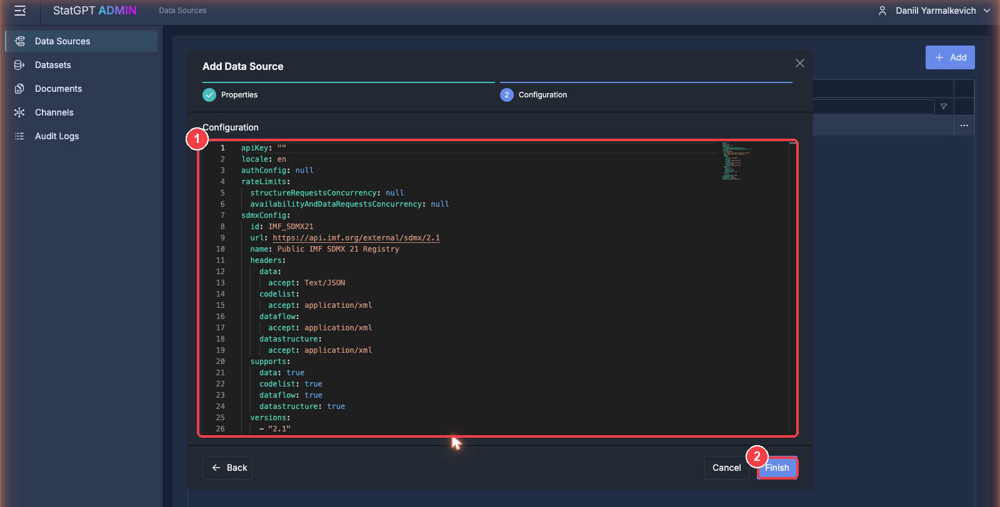

1. **Configuration editor** — the YAML configuration for the selected connector.
2. **Finish** — validate and create the data source.

A configuration for the IMF SDMX 2.1 source (connector `QH_SDMX21`) looks like this:

```yaml
apiKey: ""                       # subscription/API key, if the registry requires one
locale: en                       # locale used for indexing and querying
authConfig: null
rateLimits:                      # optional concurrency limits for outgoing requests
  structureRequestsConcurrency: null
  availabilityAndDataRequestsConcurrency: null
sdmxConfig:
  id: IMF_SDMX21                 # unique data source id
  url: https://api.imf.org/external/sdmx/2.1   # SDMX 2.1 REST endpoint
  name: Public IMF SDMX 21 Registry
  headers:                       # Accept header to send per SDMX resource type
    data:
      accept: Text/JSON
    codelist:
      accept: application/xml
    dataflow:
      accept: application/xml
    datastructure:
      accept: application/xml
    # ...also: agencyscheme, conceptscheme, categoryscheme, provisionagreement,
    #          availableconstraint, hierarchicalcodelist (all application/xml)
  supports:                      # which SDMX resource types the registry supports
    data: true
    codelist: true
    dataflow: true
    datastructure: true
    # ...(remaining resource types set to true)
  versions:
    - "2.1"
  dataContentType: JSON
authEnabled: false               # whether the source requires authentication
sdmx1Source: IMF_DATA            # sdmx1 library source profile
apiKeyHeader: Ocp-Apim-Subscription-Key
attributesUrl: https://api.imf.org/external/sdmx/3.0    # SDMX 3.0 endpoint for attributes
annotationsUrl: https://api.imf.org/external/sdmx/3.0   # SDMX 3.0 endpoint for annotations
dataExplorerUrl: https://data.imf.org/en/Data-Explorer  # link surfaced to end users
providerDiscovery: dataflows     # how providers/agencies are discovered
```

### Editing a data source

To change connection parameters later, open the row **⋯** menu and choose **Configure**. This reopens the YAML editor.

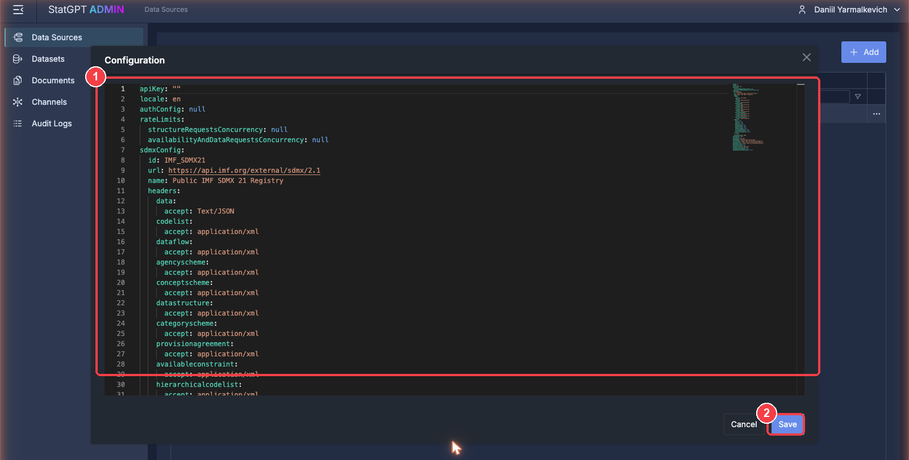

1. **Configuration editor** — edit the YAML in place.
2. **Save** — apply the changes.

> See [Module 05 — Data Sources & Channel Configuration](../learning/administration/05-data-sources-and-channels.md)
> of the learning course for connector details and source-discovery options, and
> [SDMX Compatibility & Requirements](../architecture/sdmx-compatibility.md) for the technical requirements a source
> must meet.

---

## Datasets

A dataset is an SDMX dataflow plus the StatGPT configuration that tells the agent how to query and index it.

### Browsing datasets

The **Datasets** screen lists every onboarded dataset and a single global availability **Status** (`Online`).
Per-channel indexing state lives on the [channel datasets page](#the-channel-datasets-page), not here.

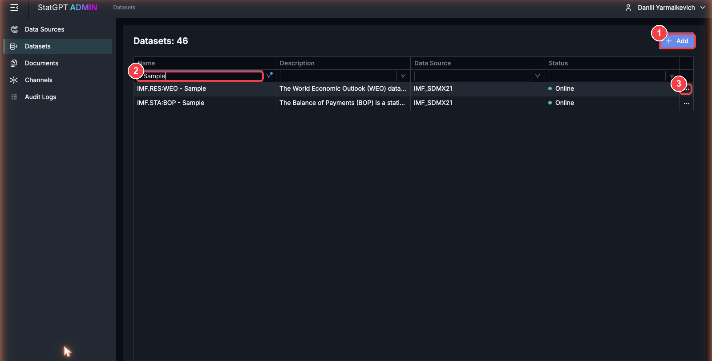

1. **+ Add** — start the *Add Dataset* wizard.
2. **Column filters** — filter by Name, Description, or Data Source.
3. **Row menu (⋯)** — **Edit dataset** or **Delete** it.

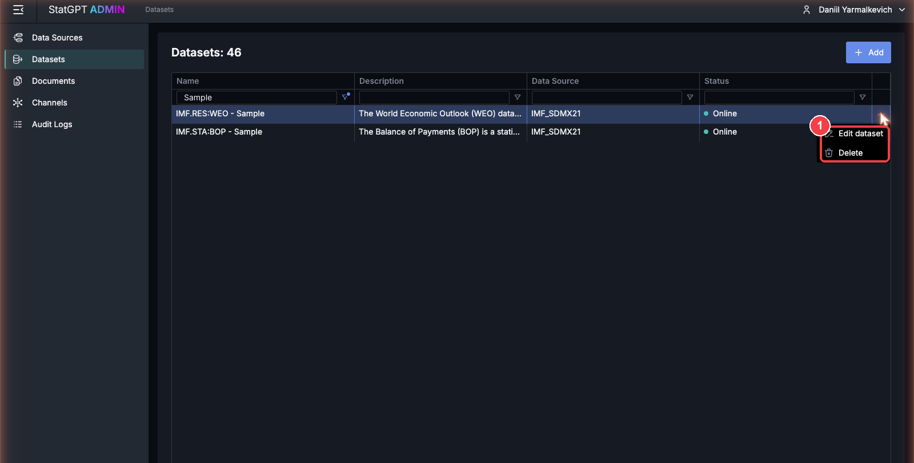

### Adding a dataset

The *Add Dataset* wizard has four steps: **Data Source → Provider → Dataset → Configuration**.

**Step 1 — Select the data source.**

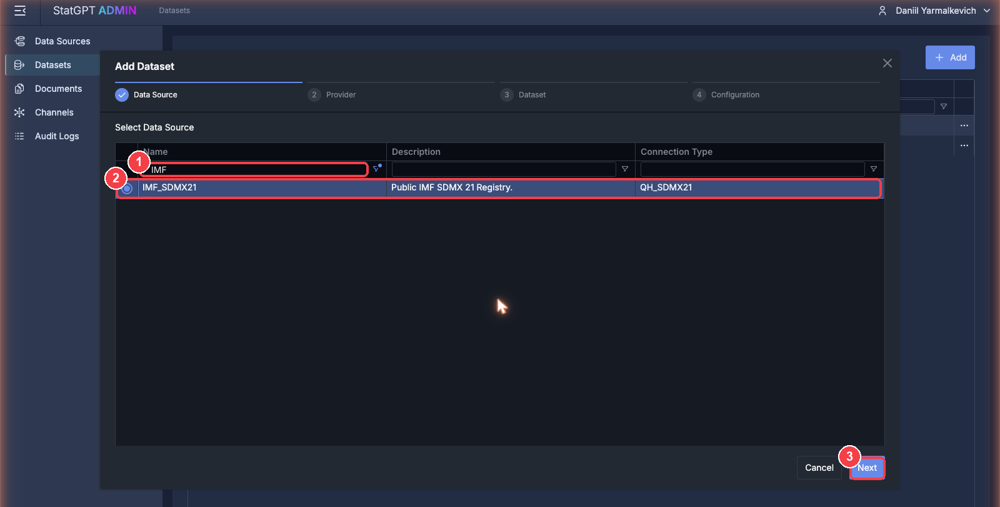

1. **Filter** the list to find the source.
2. **Select** the source (e.g. `IMF_SDMX21`).
3. **Next.**

**Step 2 — Select the provider (agency).**

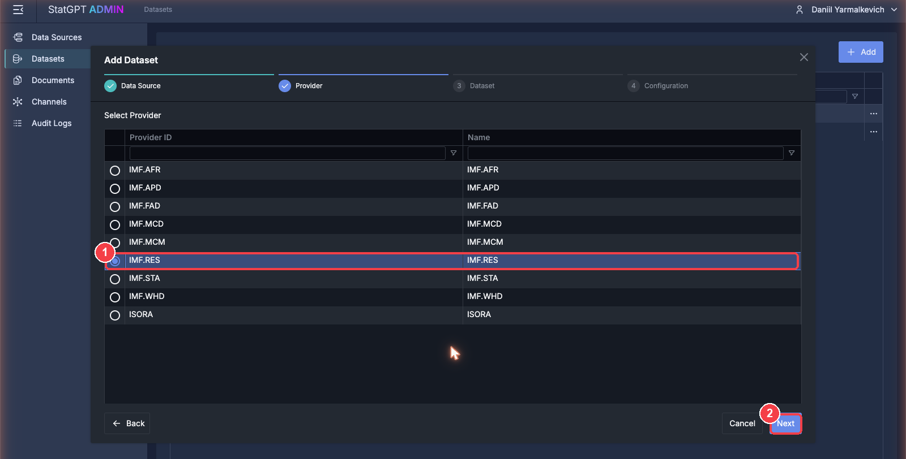

1. **Select** the agency that publishes the dataflow (e.g. `IMF.RES` for the World Economic Outlook).
2. **Next.**

**Step 3 — Select the dataflow.**

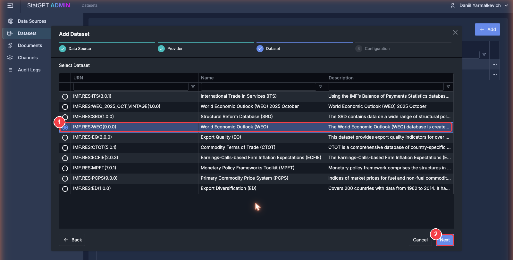

1. **Select** the dataflow to onboard (e.g. `IMF.RES:WEO`).
2. **Next.**

**Step 4 — Configuration.** StatGPT pre-fills a configuration template detected from the dataflow's structure. Review
and adjust it, then click **Finish**.

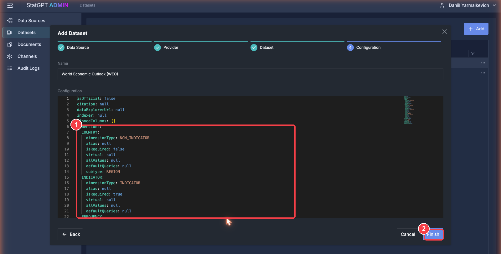

1. **`dimensions` map** — classify each dimension (see below). This is the most important part of the configuration.
2. **Finish** — create the dataset.

A configuration for the IMF WEO dataset looks like this:

```yaml
urn:                             # SDMX URN of the source dataflow
  version: latest
  agencyId: IMF.RES
  resourceId: WEO
indexer:
  indicator:
    unpack: true                 # WEO ships packed indicators -> unpack them for search
    annotations: null
    superPrimary: false
    useCodeListDescription: true
  description: >                  # dataset summary added to the agent context
    The World Economic Outlook (WEO) database contains selected macroeconomic
    data series from the statistical appendix of the World Economic Outlook
    report... (abbreviated)
citation:                        # provenance shown to end users
  url: https://data.imf.org/en/datasets/IMF.RES:WEO
  provider: IMF.RES
  description: >
    The World Economic Outlook (WEO) database... (abbreviated)
updatedAt:                       # where to read the dataset's "last updated" date from
  - field: lastUpdatedAt
    source: annotation
    formats: null
  - field: last_updated
    source: citation
    formats: null
dimensions:                      # per-dimension roles and behaviour
  COUNTRY:
    dimensionType: NON_INDICATOR
    subtype: REGION              # marks this as the country/region dimension
    alias: Country/Reference area
    isRequired: false
    allValues:                   # wildcard value used for "all countries" queries
      id: ALL_COUNTRIES
      name: All countries - must be selected when query explicitly asks for all countries
      description: Special value to query all countries
    defaultQueries: null
  FREQUENCY:
    dimensionType: NON_INDICATOR
    subtype: FREQUENCY
    isRequired: false
    alias: null
    allValues: null
    defaultQueries: null
  INDICATOR:
    dimensionType: INDICATOR     # the indicator dimension(s) the agent searches over
    isRequired: true             # a query cannot run without an indicator selected
    alias: null
    allValues: null
    defaultQueries: null
  TIME_PERIOD:
    dimensionType: TIME_PERIOD
    isRequired: false
    defaultQueries:              # default time window when the user does not specify one
      - values: ["-5y", "+2y"]
        operator: between
isOfficial: false                # official (national) sources are prioritised for country queries
pinnedColumns:                   # columns pinned in the result table
  - FREQUENCY_Name
  - COUNTRY_Name
  - INDICATOR_Name
useTitleFromSrc: false           # use the configured title instead of the source dataflow title
includeAttributes:               # SDMX attributes added to the agent context
  - SCALE
  - UNIT
  - PUBLISHER
  - SOURCE
```

**Understanding the `dimensions` map.** Every dimension is given a `dimensionType`:

- `INDICATOR` — what is measured (GDP, inflation, …). Mark the indicator(s) the agent searches over; set
  `isRequired: true` for dimensions a query cannot omit.
- `NON_INDICATOR` — context dimensions such as country, counterpart, currency, or frequency. Use `subtype`
  (`REGION`, `FREQUENCY`, …), `alias` (a stable name used for indexing across datasets), and `allValues` (a wildcard
  member, e.g. "all countries").
- `TIME_PERIOD` — the time dimension, optionally with `defaultQueries` (relative offsets such as `-5y`/`+2y`).

> Dimension classification, packed vs. unpacked indicators, and the full field reference are covered in the learning
> course: [Module 03a — Dimension Types & Named Entities](../learning/administration/03a-dimension-types.md),
> [Module 03b — Indicator Configuration](../learning/administration/03b-indicator-configuration.md), and
> [Module 04 — Configuring a Dataset](../learning/administration/04-dataset-configuration.md).

### Editing a dataset

Choose **Edit dataset** from the row menu to reopen the configuration. This is typically required when the dataflow
structure changes or indexing parameters need tuning.

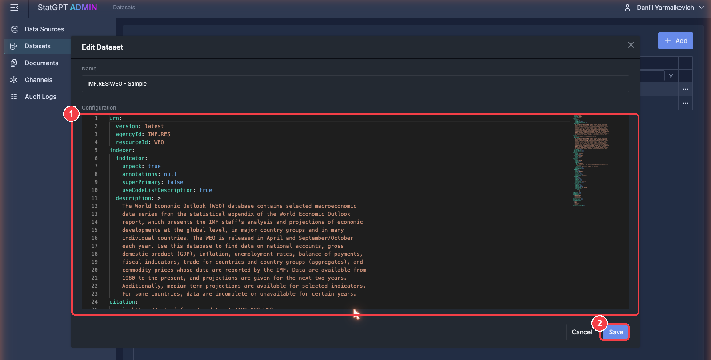

1. **Configuration editor** — the dataset YAML.
2. **Save** — saving a configuration change creates a new index version in every channel that uses the dataset.

---

## Channels

A channel is a self-contained StatGPT application: its own agent configuration, set of datasets, glossary, and index.

### Browsing channels

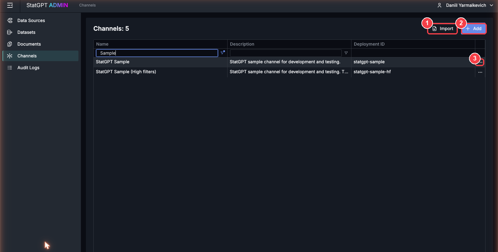

1. **Import** — create a channel from an exported zip archive (see [Import / Export & Jobs](#import--export--jobs)).
2. **+ Add** — create a new, empty channel.
3. **Row menu (⋯)** — per-channel actions:

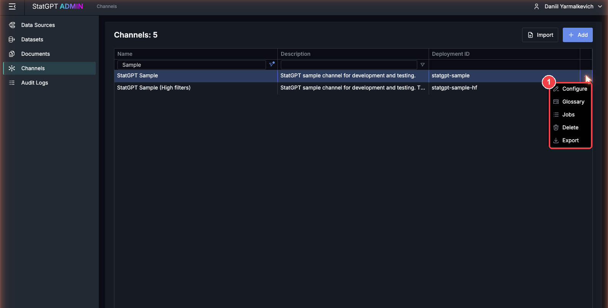

The channel **⋯** menu offers **Configure**, **Glossary**, **Jobs**, **Delete**, and **Export**.

### Configuring a channel

Choose **Configure** to edit the channel's YAML configuration (agent behaviour, conversation starters, tools, etc.).

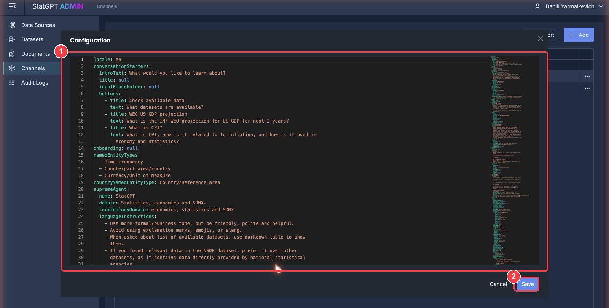

1. **Configuration editor** — the channel YAML.
2. **Save** — apply the configuration.

A configuration for the **StatGPT Sample** channel looks like this (long tool descriptions are abbreviated):

```yaml
locale: en
conversationStarters:            # prompts shown on the empty chat screen
  introText: Search {indicators_total} official indicators from the IMF
  title: What would you like to learn about?
  inputPlaceholder: Ask about GDP, inflation or any other IMF indicator
  buttons:
    - title: Check available data
      text: What datasets are available?
    - title: WEO US GDP projection
      text: What is the IMF WEO projection for US GDP for next 2 years?
    - title: What is CPI?
      text: What is CPI, how is it related to inflation, and how is it used in economy and statistics?
onboarding: null
namedEntityTypes:                # non-indicator dimensions recognised in user queries
  - Time frequency
  - Counterpart area/country
  - Currency/Unit of measure
countryNamedEntityType: Country/Reference area
supremeAgent:                    # main orchestrating agent
  name: StatGPT
  domain: Statistics, economics and SDMX.
  terminologyDomain: economics, statistics and SDMX
  languageInstructions:
    - Use more formal/business tone, but be friendly, polite and helpful.
    - Avoid using exclamation marks, emojis, or slang.
    - When asked about list of available datasets, use markdown table to show them.
  llmModelConfig:
    deployment: gpt-4.1-2025-04-14
outOfScope:                      # guardrail that declines off-topic questions
  domain: Statistics, economics and SDMX.
  useGeneralTopicsBlacklist: true
  llmModelConfig:
    deployment: gpt-4.1-2025-04-14
tokenUsage:                      # token-usage reporting stage
  debugOnly: false
  stageName: Token Usage

# ---- Tools available to the agent ----

availableDatasets:               # lists onboarded datasets with metadata
  type: AVAILABLE_DATASETS
  name: Available_Datasets
  description: >-
    Provides a list of all available datasets onboarded to the `Query_Data` tool... (abbreviated)
  details:
    fakeCall:
      toolCallId: call_EBJJeaOMKeCzm8h378ubURQN
    version: full
    includeIndicatorCount: true

datasetStructure:                # describes the structure (dimensions/attributes) of one dataset
  type: DATASET_STRUCTURE
  name: Dataset_Structure
  description: >-
    Provides the structure of a specific dataset, including its dimensions, attributes,
    their types and sample values... (abbreviated)
  details:
    stagesConfig:
      toolCallName: "Looking into structure of dataset '{dataset_id}'"
      toolResultName: "Structure of dataset '{dataset_id}'"

dataQuery:                       # builds and executes SDMX queries from natural language
  type: DATA_QUERY
  name: Query_Data
  description: >-
    Executing sdmx query on available datasets. Some datasets include forecasts for next years... (abbreviated)
  details:
    allowAutoUpdate: true        # allow scheduled auto-update jobs to refresh the index
    indexerVersion: hybrid
    indicatorSelectionVersion: hybrid
    hybridSearchConfig:          # hybrid (keyword + semantic + LLM) search tuning
      namedEntitiesToRemove:
        - Country/Reference area
        - Counterpart area/country
      prompts:
        relevancyPrompts: { systemMessage: "...", userMessage: "..." }   # (abbreviated)
    llmModels:                   # per-stage LLM configuration (all gpt-4.1 here)
      datasetsSelectionModelConfig:   { deployment: gpt-4.1-2025-04-14, temperature: 0.0 }
      dimensionsSelectionModelConfig: { deployment: gpt-4.1-2025-04-14, temperature: 0.0 }
      indicatorsSelectionModelConfig: { deployment: gpt-4.1-2025-04-14, temperature: 0.0 }
      # ...incompleteQueries, groupExpander, namedEntities, queryNormalization, timePeriod
    attachments:                 # artifacts returned alongside the answer
      customTable:      { enabledStr: "True",  name: "Data: {dataset_source_id}" }
      plotlyGrid:       { enabledStr: "$env:{DIAL_SHOW_PLOTLY_GRID|False}", name: "Plotly Grid: {dataset_source_id}" }
      csvFile:          { enabledStr: "False" }
      plotlyGraphs:     { enabledStr: "False" }
      jsonQuery:        { enabledStr: "True",  name: "Query (JSON): {dataset_source_id}" }
      pythonCode:       { enabledStr: "True",  name: "Python Code: {dataset_source_id}" }
      mergedPythonCode: { enabledStr: "True",  name: "Python Code" }   # single consolidated code block
    stagesConfig:
      debugOnly: true
      toolCallName: "Searching for data: {query}"
      toolResultName: "Data search result: {query}"
      rules:                     # which stages are visible to end users
        - { key: constructing_data_query, debugOnly: false }
        - { key: extracting_named_entities, debugOnly: false }
        - { key: executing_data_query, debugOnly: false }
        - { key: normalizing_query, debugOnly: false }
        - { key: selecting_indicators, debugOnly: false }
    messages:
      noData: No data was found for the provided query. Try to change the query.
      # ...noDataForCountry, dataQueryExecutedAgentOnly, multipleDatasetsAgentOnly

availableTerms:                  # lists glossary terms
  type: AVAILABLE_TERMS
  name: Available_Terms
  description: >-
    Use this tool to retrieve a comprehensive list of all terms currently available in the glossary... (abbreviated)
  details:
    fakeCall:
      toolCallId: call_EBJJeaOMKeCzm8h378ubU003

termDefinitions:                 # returns definitions for requested glossary terms
  type: TERM_DEFINITIONS
  name: Term_Definitions
  description: >-
    Use this tool to retrieve definitions for up to 10 requested terms that appear in the glossary... (abbreviated)
  details:
    stagesConfig:
      toolCallName: "Searching in Glossary of Terms: {terms}"
      toolResultName: "Glossary search result: {terms}"
    limit: 10
```

> The agent design and the role of each tool are described in [architecture/agent.md](../architecture/agent.md) and
> [architecture/tools.md](../architecture/tools.md). For a configuration walkthrough, see
> [Module 05 — Data Sources & Channel Configuration](../learning/administration/05-data-sources-and-channels.md).

### The channel datasets page

Double-click a channel row (or open it) to reach the **channel datasets page**. This is where datasets are attached to
the channel and where all indexing happens.

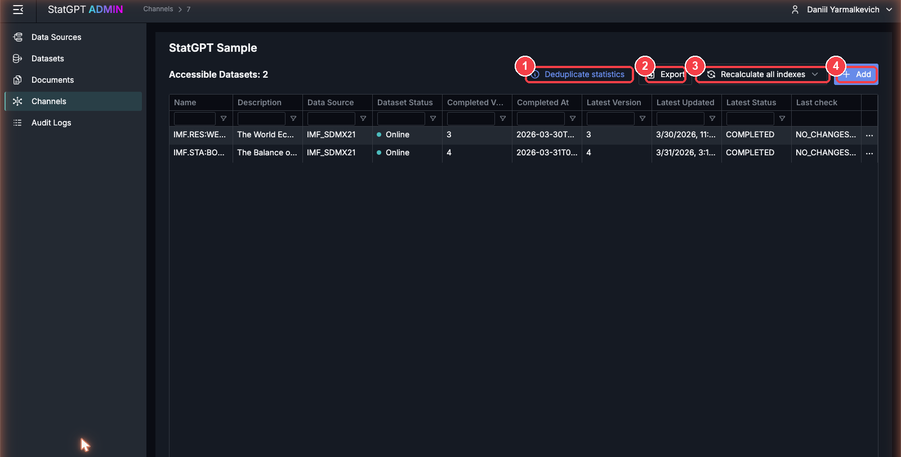

The toolbar provides channel-level operations:

1. **Deduplicate statistics** — show how many duplicate embeddings exist across the channel's datasets.
2. **Export** — export the channel (configuration + index) as a zip.
3. **Recalculate all indexes ▾** — reindex every dataset in the channel.
4. **+ Add** — attach an existing dataset to this channel.

The table shows, per dataset: **Data Source**, the global **Dataset Status** (`Online`), the **Completed Version**
and **Completed At** (the version currently served), the **Latest Version** / **Latest Updated** / **Latest Status**
of the most recent indexing attempt, and **Last check** (the result of the most recent auto-update check).

> To attach a dataset, click **+ Add** and pick from the datasets already onboarded under **Datasets**. (A dataset
> must exist before it can be added to a channel.)

#### Per-dataset actions

Each dataset row has a **⋯** menu with its own set of actions:

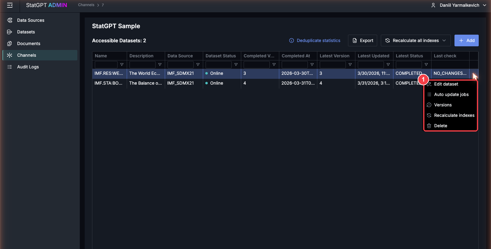

- **Edit dataset** — edit the dataset configuration.
- **Auto update jobs** — view the scheduled source-check history (below).
- **Versions** — view the dataset's index versions in this channel (below).
- **Recalculate indexes** — rebuild this dataset's index for this channel.
- **Delete** — remove the dataset from this channel.

#### Versions

The **Versions** page lists every index version built for the dataset in this channel.

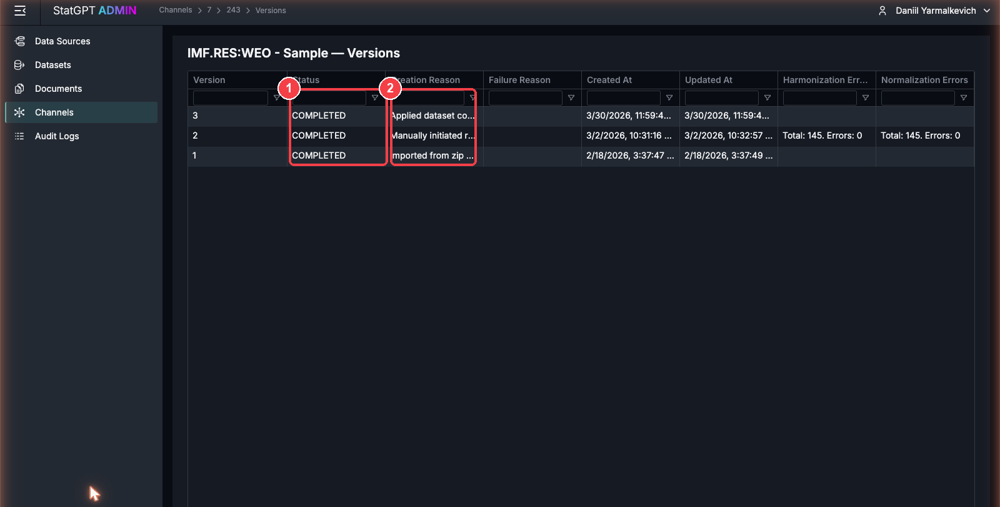

1. **Status** — `COMPLETED` versions are eligible to be served; failed builds are kept for diagnostics.
2. **Creation Reason** — why the version was created:
   - *Applied dataset config change* — the dataset configuration was edited.
   - *Manually initiated reindex* — an admin triggered **Recalculate indexes**.
   - *Imported from zip* — the version arrived with a channel import.

Other columns record the **Created At** / **Updated At** timestamps and any **Harmonization** / **Normalization**
errors encountered while indexing.

#### Auto update jobs

When `dataQuery.details.allowAutoUpdate` is enabled, StatGPT runs a scheduled job that checks the source for new data.
The **Auto update jobs** page is the history of those checks.

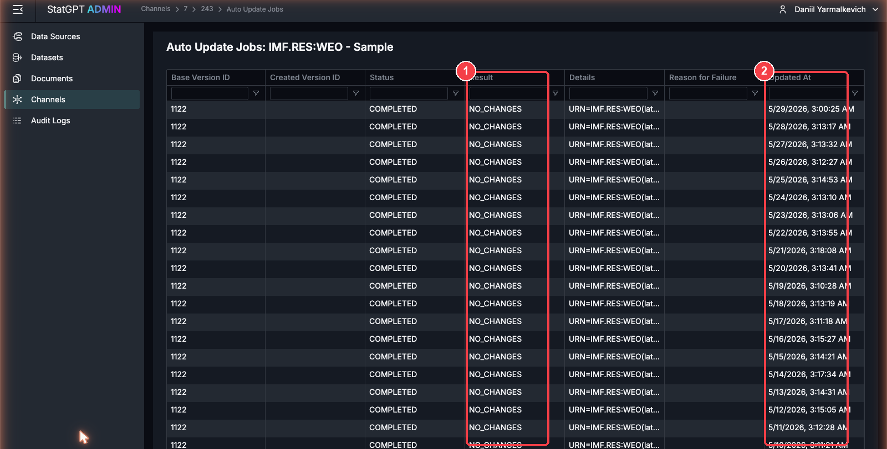

1. **Result** — `NO_CHANGES` means the source was unchanged and no new version was built; a change would trigger a new
   index version automatically.
2. **Updated At** — the daily cadence of the checks.

Each row also records the **Base Version ID** that was checked, any **Created Version ID** (when a new version was
built), the job **Status**, and the URN that was inspected under **Details**.

#### Indexing operations

StatGPT relies on a hybrid index (keyword + semantic + LLM reasoning) over dataset metadata. You can rebuild indexes at
two levels.

**One dataset** — choose **Recalculate indexes** from the dataset's **⋯** menu.

**All datasets in the channel** — use the **Recalculate all indexes ▾** button and pick a mode:

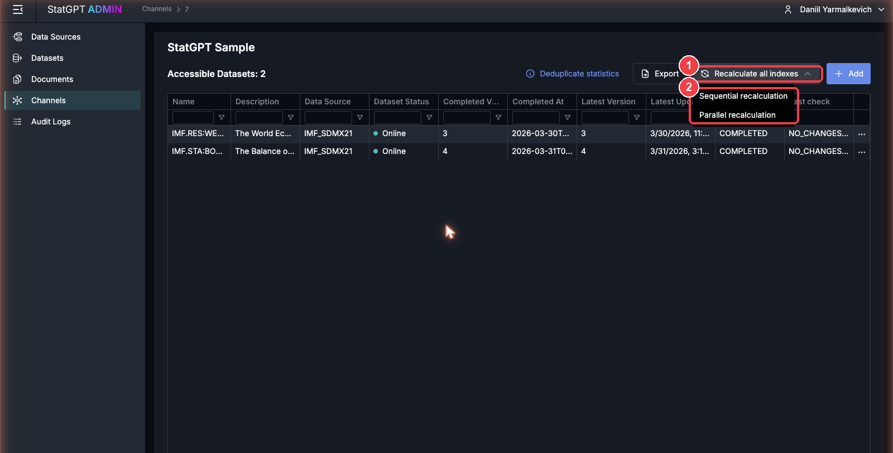

1. **Recalculate all indexes** opens the mode menu.
2. Choose **Sequential recalculation** (one dataset at a time, lighter on resources) or **Parallel recalculation**
   (faster, more resource-intensive).

**Deduplicate statistics** reports duplicate embeddings across the channel's datasets — useful before or after large
reindexing operations. In the sample channel everything is already deduplicated, so all counts are `0`.

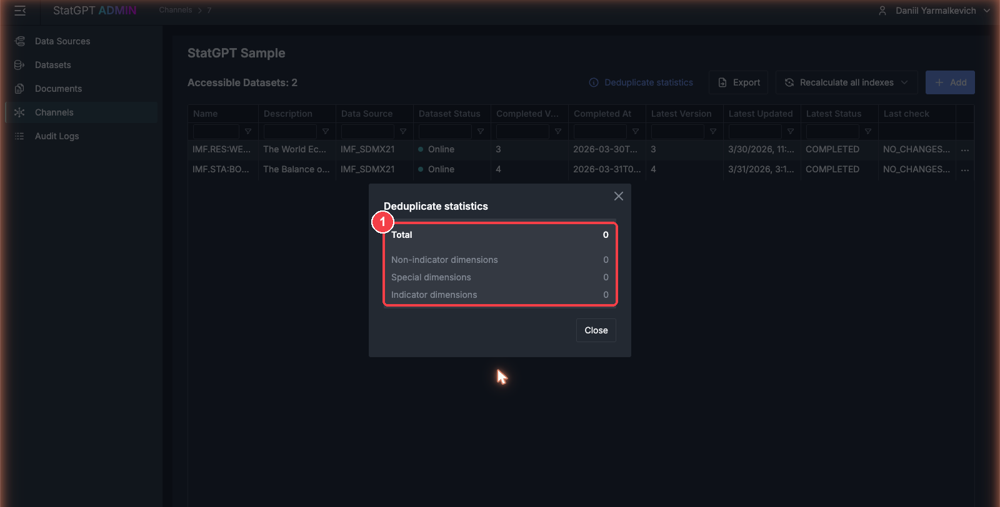

> Indexing, deduplication, auto-update, and cost considerations are covered in detail in
> [Module 06 — Indexing, Deduplication & Operations](../learning/administration/06-indexing-and-operations.md).

### Glossary of Terms

Each channel has its own glossary — a set of term/definition pairs the glossary tools use to explain terminology to
users. Open it from the channel **⋯** menu → **Glossary**.

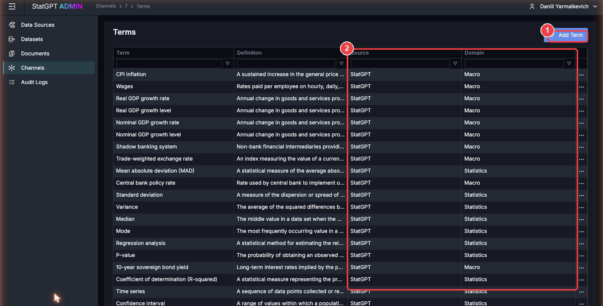

1. **+ Add Term** — add a new term.
2. Each term carries a **Source** and a **Domain** (e.g. `Macro`, `Statistics`) in addition to its definition.

Use **+ Add Term** (or **Edit** from a row's menu) to open the term form:

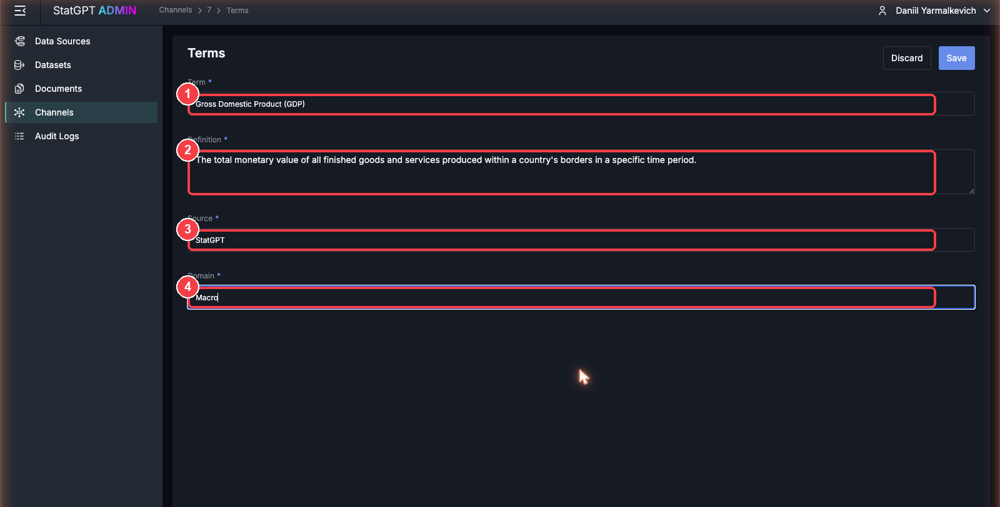

1. **Term** — the term itself.
2. **Definition** — the explanation surfaced to users.
3. **Source** — where the definition comes from.
4. **Domain** — a category used to group terms.

Each row's **⋯** menu offers **Edit** and **Delete**:

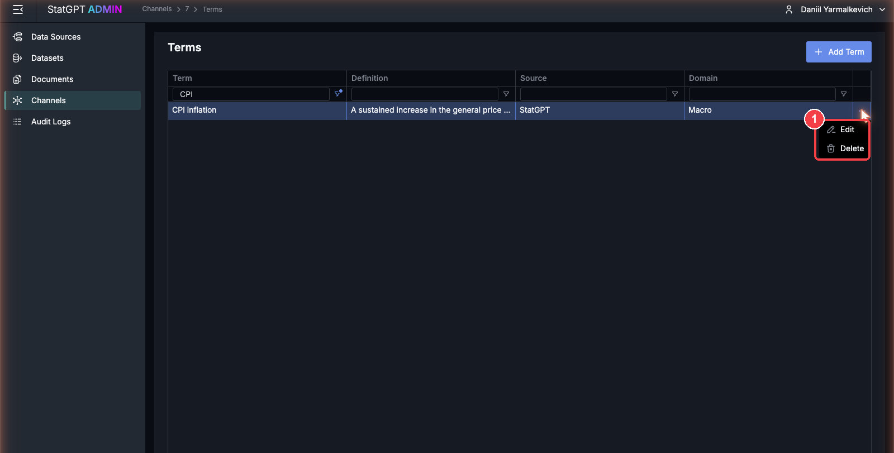

> **Note:** deleting a glossary term takes effect immediately — there is no confirmation dialog. Delete with care.

### Import / Export & Jobs

Import/Export lets you move a channel — its configuration and index — between environments as a zip archive. Each
import or export runs as a background **job** linked to the channel.

**Export** a channel from its **⋯** menu (or with the **Export** button on the channel datasets page).

**Import** a channel with the **Import** button on the channels list:

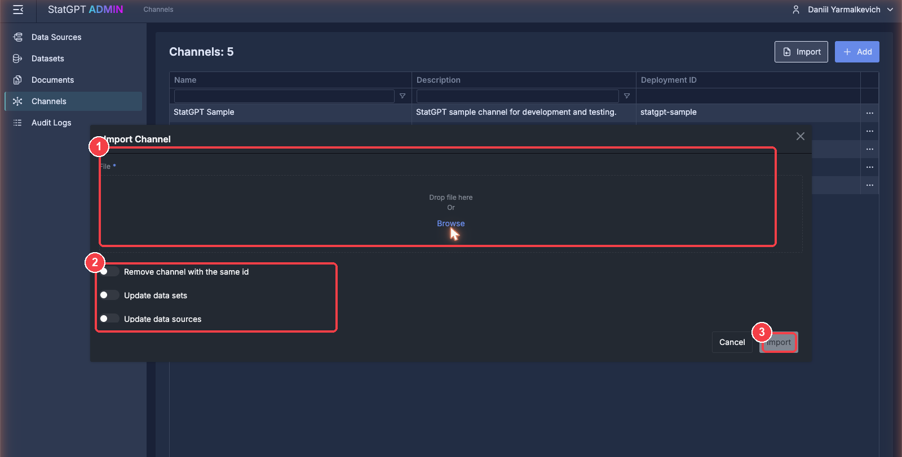

1. **File** — drop or browse for the exported zip.
2. **Toggles:**
   - `Remove channel with the same id` — delete any existing channel with the same ID before importing. If left off,
     the import fails when a channel with that ID already exists.
   - `Update data sets` — update datasets to the versions in the archive.
   - `Update data sources` — update data sources to the versions in the archive.
3. **Import** — start the import job.

**Jobs.** Open the channel **⋯** menu → **Jobs** to see the import/export history for the channel, review job status,
and download artifacts.

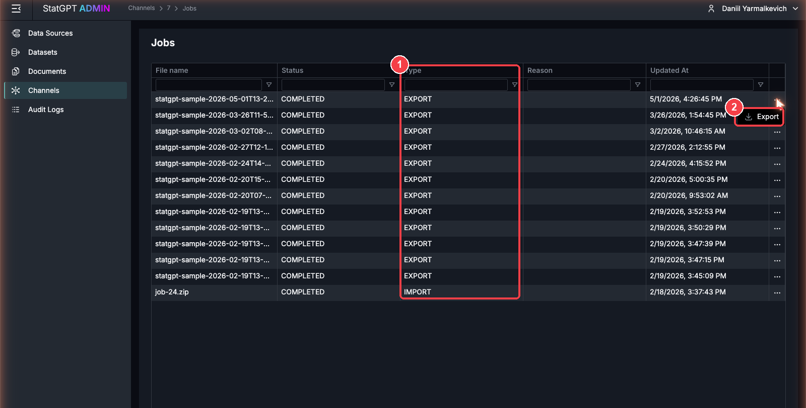

1. **Type** — `EXPORT` or `IMPORT`, each with a `Status` (e.g. `COMPLETED`).
2. **Export (download)** — for a completed export, the row **⋯** menu lets you download the resulting artifact.

---

## Audit Logs

The **Audit Logs** screen is a chronological record of configuration changes across data sources, channels, and
datasets. Use the column filters to scope the view (here it is filtered to the sample entities).

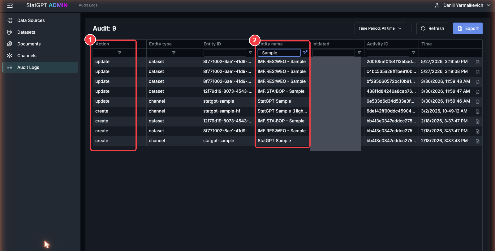

1. **Action** — what happened (`create`, `update`, `delete`).
2. **Entity name** — which object was affected, alongside its **Entity type** (`data_source`, `channel`, `dataset`)
   and **Entity ID**.

Each entry also records who initiated the change (the **Initiated** column, redacted in this screenshot), an
**Activity ID**, and the **Time**.

---

## Related resources

- [Admin Learning Course](../learning/administration/README.md) — end-to-end dataset onboarding methodology.
- [Architecture Overview](../architecture/overview.md) and [Agent design](../architecture/agent.md).
- [SDMX Compatibility & Requirements](../architecture/sdmx-compatibility.md).
