# Administrator Guide

This document covers the StatGPT Admin Frontend, its features, and StatGPT configurations.

## Administrator App

StatGPT Admin is an application that focuses solely on managing StatGPT configurations, including data sources,
datasets,
and channels. The application does not cover user management, authentication, authorization, monitoring, or cost
control,
which are handled by the DIAL platform. More information on this topic can be found
in the [architecture overview article](../architecture/overview.md#-core-requirements).

## Concepts

StatGPT uses several key concepts that will be referenced throughout this document:

1. **Data Source** - A source of data that can be queried using the SDMX protocol. Examples of data sources include IMF,
   Eurostat,
   World Bank, etc.
2. **Dataset** - A direct representation of an SDMX dataflow in a datasource, with the addition of StatGPT-specific
   configurations.
3. **Channel** - A representation of the StatGPT application for end users. Each channel has its own
   configuration, datasets, and index. Having multiple channels allows experimentation with different LLM/index/dataset
   configurations.
   Each channel is represented as a separate DIAL Application.

## Add Data Source

To add a new data source:

1. Navigate to the "Data Sources" tab and click the "Add" button
   
2. Fill in the required fields in the form, including selecting the datasource type:
   
3. Fill the configuration fields for the selected datasource type and save the datasource:
   

Configuration for an IMF SDMX 2.1 datasource with English locale is as follows:

```yaml
locale: en  # Locale for the datasource, e.g., 'en' for English. Used for indexing and querying.
sdmxConfig:
  id: IMF_SDMX21  # Unique identifier for the datasource
  url: https://api.imf.org/external/sdmx/2.1  # IMF SDMX 2.1 REST API endpoint
  name: Public IMF SDMX 21 Registry  # Human-readable name for the datasource
  headers: # HTTP headers for specific structures and data requests
    data:
      accept: Text/JSON
    codelist:
      accept: application/xml
    dataflow:
      accept: application/xml
    agencyscheme:
      accept: application/xml
    conceptscheme:
      accept: application/xml
    datastructure:
      accept: application/xml
    categoryscheme:
      accept: application/xml
    provisionagreement:
      accept: application/xml
    availableconstraint:
      accept: application/xml
    hierarchicalcodelist:
      accept: application/xml
  supports: # Supported SDMX features
    data: true
    preview: true
    codelist: true
    dataflow: true
    agencyscheme: true
    conceptscheme: true
    datastructure: true
    categoryscheme: true
    provisionagreement: true
    availableconstraint: true
    hierarchicalcodelist: true
  data_content_type: JSON
authEnabled: false  # Whether authentication is required to access the datasource
description: ""  # Optional description of the datasource
annotationsUrl: https://api.imf.org/external/sdmx/3.0  # Optional URL for annotations
```

Once the datasource is created, you can edit its details by clicking the "Edit" button in the data sources section.
This is typically required when datasource characteristics or connection parameters have changed.

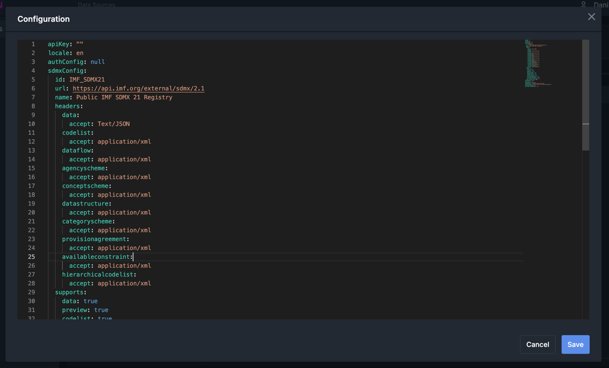

## Datasets

To add a new dataset from an already configured datasource:

1. Navigate to the "Datasets" tab and click on the "Add" button
2. Select the datasource from the table and click "Next":
   
3. You will see a table of datasets available in the selected datasource. Select the desired dataset from the
   table and click "Next":
   
4. Fill in the required fields in the form and save the dataset:
   

Configuration for the IMF WEO dataset is as follows:

```yaml
urn: IMF.RES:WEO(6.0.0)  # SDMX urn of the dataset
citation: # citation for the dataset
  url: https://data.imf.org/en/datasets/IMF.RES:WEO  # URL to the dataset web page
  provider: IMF.RES  # data provider
  description: &weo_description >  # detailed description of the dataset
    The World Economic Outlook (WEO) database contains selected macroeconomic
    data series from the statistical appendix of the World Economic Outlook
    report, which presents the IMF staff's analysis and projections of economic
    developments at the global level, in major country groups and in many
    individual countries. The WEO is released in April and September/October
    each year. Use this database to find data on national accounts, gross
    domestic product (GDP), inflation, unemployment rates, balance of payments,
    fiscal indicators, trade for countries and country groups (aggregates), and
    commodity prices whose data are reported by the IMF. Data are available from
    1980 to the present, and projections are given for the next two years.
    Additionally, medium-term projections are available for selected indicators.
    For some countries, data are incomplete or unavailable for certain years.
isOfficial: false  # whether the dataset is from an official source (usually country-level sources are considered official and prioritized in answers for specific country queries)
pinnedColumns: # list of columns to pin in the dataset table
  - FREQUENCY_Name
  - COUNTRY_Name
  - INDICATOR_Name
useTitleFromSrc: true  # whether to use the title from the source Dataflow
countryDimension: COUNTRY  # dimension representing the country or region
includeAttributes: # list of attributes to include in the AI Agent context
  - SCALE
  - UNIT
  - PUBLISHER
  - SOURCE
indicatorDimensions: # list of the dimensions representing the dataset indicators
  - INDICATOR
updatedAtAnnotation: lastUpdatedAt  # SDMX annotation to use for the "last updated at" information
countryDimensionAlias: Country/Reference area  # alias for the country dimension (dimensions can be named differently in different datasets, therefore alias helps to unify the naming for indexing and querying)
dimensionDefaultQueries:
  TIME_PERIOD:
    - values:
        - "2020"
        - "2025"
      operator: between
indicatorDimensionsRequiredForQuery: # indicator dimension that required to be filled for querying the dataset
  - INDICATOR

indexer: # indexer configuration for the dataset
  indicator:
    unpack: true  # whether to unpack the indicator dimensions (e.g. in WEO packed indicators are used, therefore unpack=true)
    use_code_list_description: false  # whether to use code list description for indexing
  description: *weo_description  # description to use for indexing
```

Once the dataset is created, you can edit its details by clicking the "Edit" button in the datasets section. This is
typically required when the dataset structure has changed or indexing parameters need to be updated.

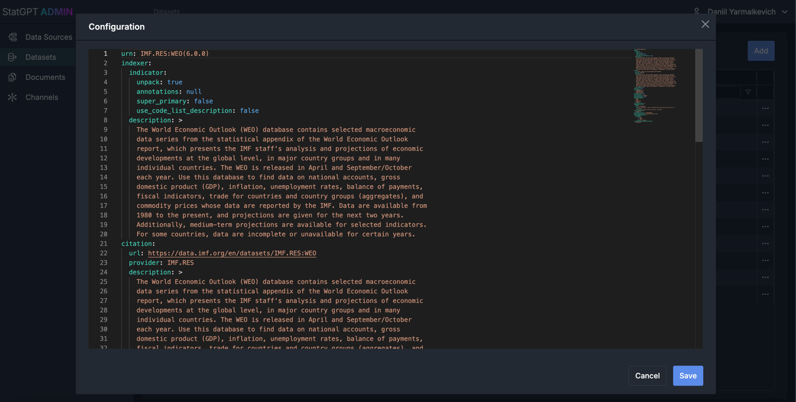

## Channels

To add a new channel:

1. Navigate to the "Channels" tab and click on the "Add" button
2. Fill in the required fields in the form and save the channel:
   
3. Add channel configurations as described in the next section:
   
4. Once the channel is created you will be redirected to the channel details page. Here you can add datasets to the
   channel:
   

Configuration for the Global Data channel is as follows:

```yaml
conversationStarters: # predefined conversation starters to show in the chat interface
  introText: What would you like to learn about?
  buttons:
    - title: Check available data
      text: What datasets are available?
    - title: Annual US investment in Mexico
      text: What was the annual total investment of the US economy in the Mexican
        economy?
    - title: What is inflation?
      text: What is inflation and how it's used in economy and statistics?
namedEntityTypes: # list of named entity types to recognize in user queries. Used for non-indicator dimensions recognition. Set of named entity types depends on the datasets composition in the channel.
  - Time frequency
  - Counterpart area/country
  - Currency/Unit of measure
countryNamedEntityType: Country/Reference area   # named entity type representing countries/regions
supremeAgent: # main agent configuration
  name: StatGPT  # agent name to be used in the agent context
  domain: Statistics, economics and SDMX.  # agent domain to be used in the agent context
  terminologyDomain: economics, statistics and SDMX  # domain for the terminology to be used in the agent context
  languageInstructions: # additional language instructions for the agent
    - Use more formal/business tone, but be friendly, polite and helpful.
    - Avoid using exclamation marks, emojis, or slang.
  maxAgentIterations: 5  # maximum number of agent iterations (tool calls) per user query
  llmModelConfig:
    apiVersion: 2024-08-01-preview  # LLM API version
    deployment: gpt-4.1-2025-04-14  # LLM deployment name
    temperature: 0  # LLM temperature
    seed: 820288  # LLM seed for reproducibility
outOfScope: # configurations of the out-of-scope filter of the agent
  domain: Statistics, economics and SDMX.  # domain to be used in the out-of-scope filter context
  customInstructions: null  # additional custom instructions for the out-of-scope filter
tokenUsage: # token usage tracking configuration
  debugOnly: false  # whether to track token usage only in debug mode
  stageName: Token Usage  # name of the DIAL stage to log token usage
availableDatasets: # configurations for the Available_Datasets tool
  type: AVAILABLE_DATASETS
  name: Available_Datasets
  description: >-  # Extensive description of the tool and its usage instructions, will be provided to the agent's context
    Provides a list of all available datasets onboarded to the `Query_Data` tool
    with metadata and some details about them. Details include the name and
    description of the dataset, the provider (agency), and the last update date.

    This tool does not accept any arguments.

    For questions about the availability of indicators you should refer to the
    `Query_Data` tool.
  details:
    fakeCall: # fake tool call to put the tool call along with tool response in the agent's context by default
      toolCallId: call_EBJJeaOMKeCzm8h378ubURQN
      args: "{}"
    stagesConfig:
      debugOnly: true
      rules: [ ]
    version: full
dataQuery: # Data Query tool configuration
  type: DATA_QUERY
  name: Query_Data
  description: >-
    Executing sdmx query on available datasets. Some datasets include forecasts
    for next years.

    Constructed query is used to fetch indicators from one of the datasets.

    Instructions:

    * Don't try to expand country groups or regions, it's done by tool itself

    * Summarize but DON'T REPHRASE time filter: "from now to 2030" must remain
    "from now to 2030"

    * Tool works best for single indicator query (e.g. GDP, inflation)

    * Tool supports star-queries for countries, e.g. "Give GDP for all
    countries"

    * Tool may ask clarifications if query is unclear. If query is modified
    accordingly, tool will provide
      requested data.
    * Good query example: "Please give me wage information of USA"

    * Bad query example: "What are the recent economy indicators for Baltic
    countries?"
      Reason: ambiguous query, specific indicators should be mentioned, e.g. GDP, unemployment rate

    Keep in mind: tool works best when detailed and concise query is provided
  details:
    stagesConfig: # configurations of the different stages of the tool execution to be shown to user
      debugOnly: true
      rules:
        - pattern: Constructing Data Queries
          debugOnly: false
        - pattern: Extracting Named Entities
          debugOnly: false
        - pattern: Executing Data Queries
          debugOnly: false
        - pattern: Normalizing Query
          debugOnly: false
        - pattern: Selecting Indicators
          debugOnly: false
    version: v2  # version of the tool
    indexerVersion: hybrid  # version of the indexer used for the tool
    indicatorSelectionVersion: hybrid  # version of the indicator selection algorithm used for the tool
    llmModels: # Configurations of the LLM models used in different stages of the tool execution
      datasetsSelectionModelConfig:
        apiVersion: 2024-08-01-preview
        deployment: gpt-4.1-2025-04-14
        temperature: 0
        seed: 820288
      dimensionsSelectionModelConfig:
        apiVersion: 2024-08-01-preview
        deployment: gpt-4.1-2025-04-14
        temperature: 0
        seed: 820288
      indicatorsSelectionModelConfig:
        apiVersion: 2024-08-01-preview
        deployment: gpt-4.1-2025-04-14
        temperature: 0
        seed: 820288
      incompleteQueriesModelConfig:
        apiVersion: 2024-08-01-preview
        deployment: gpt-4.1-2025-04-14
        temperature: 0
        seed: 820288
      groupExpanderModelConfig:
        apiVersion: 2024-08-01-preview
        deployment: gpt-4.1-2025-04-14
        temperature: 0
        seed: 820288
      namedEntitiesModelConfig:
        apiVersion: 2024-08-01-preview
        deployment: gpt-4.1-2025-04-14
        temperature: 0
        seed: 820288
      timePeriodModelConfig:
        apiVersion: 2024-08-01-preview
        deployment: gpt-4.1-2025-04-14
        temperature: 0
        seed: 820288
      queryNormalizationModelConfig:
        apiVersion: 2024-08-01-preview
        deployment: gpt-4.1-2025-04-14
        temperature: 0
        seed: 820288
    messages: # predefined messages to be used in different situations during the tool execution
      noDataForCountry: No data was found for {country_details}. Try to change the query.
      noData: No data was found for the provided query. Try to change the query.
      dataQueryExecutedAgentOnly: >-
        If the executed query is only remotely related to the user query, you
        must mention that fact to the user,

        to not mislead them. It is recommended to search in other sources using
        tools available.

        Result of the executed query is shown to the user in the table
        attachment.
      multipleDatasetsAgentOnly: >-
        If the executed query is only remotely related to the user query, it is
        recommended to mention that fact to

        the user, instead of suggesting user to choose one of the datasets.
        Other tools might be used to search for

        the data.
    attachments: # configurations of the attachments to be provided to user along with the tool response
      customTable:
        enabledStr: "True"
        name: "Data: {dataset_source_id}"
      plotlyGrid:
        enabledStr: $env:{DIAL_SHOW_PLOTLY_GRID|False}
        name: "Plotly Grid: {dataset_source_id}"
      csvFile:
        enabledStr: "True"
        name: "Data (CSV): {dataset_source_id}.csv"
      plotlyGraphs:
        enabledStr: "True"
        name: "Graph: {figure_title}"
      jsonQuery:
        enabledStr: "True"
        name: "Query (JSON): {dataset_source_id}"
      pythonCode:
        enabledStr: "True"
        name: "Python Code: {dataset_source_id}"
availableTerms: # configurations for the Available_Terms tool
  type: AVAILABLE_TERMS
  name: Available_Terms
  description: >-  # Extensive description of the tool and its usage instructions, will be provided to the agent's context
    Use this tool to:

    * Retrieve a comprehensive list of all terms currently available in the
    glossary.

    * Confirm whether a specific term exists in the glossary.


    Detailed Guidance:

    * The list of available glossary terms provided by this tool is complete;
    there are no additional terms beyond
      what is returned.
    * Whenever referring to or explaining to user any glossary terms you must
    obtain the definitions of any listed
      terms using the "Term_Definitions" tool.
  details:
    fakeCall: # fake tool call to put the tool call along with tool response in the agent's context by default
      toolCallId: call_EBJJeaOMKeCzm8h378ubU003
      args: "{}"
    includeDomain: false
    includeSource: false
termDefinitions: # configurations for the Term_Definitions tool
  type: TERM_DEFINITIONS
  name: Term_Definitions
  description: >-  # Extensive description of the tool and its usage instructions, will be provided to the agent's context
    Use this tool to:

    * Retrieve definitions for up to 10 requested terms that appear in the
    glossary.

    * Consult the "Available_Terms" tool if you are unsure which terms are in
    the glossary.


    Detailed Guidance:

    * Confirm availability of terms using the "Available_Terms" tool first.
  details:
    stagesConfig:
      toolCallName: Glossary search result
      debugOnly: true
      rules: [ ]
    limit: 10
```

Channel has the following context menu options:

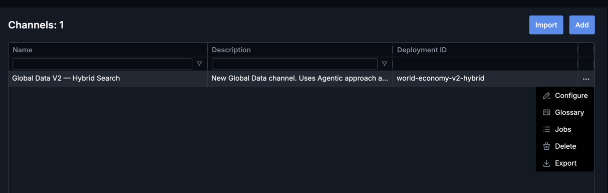

Once the channel is created, you can edit its details by clicking the "Edit" button in the channels section. This
is typically required when configurations need to be updated.

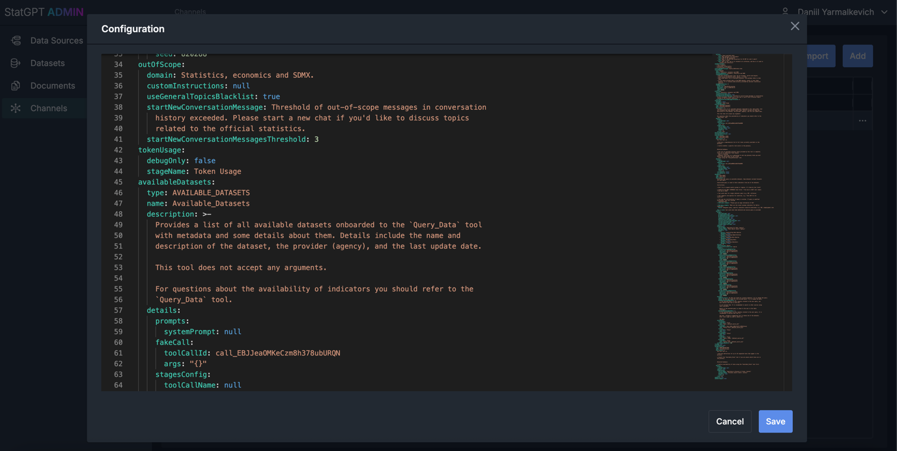

### Glossary of Terms

Once a channel is created, you can create and edit a glossary for that channel. The glossary is a set of term-definition
pairs
used by glossary tools to explain various terms and their definitions to users.

By selecting "Glossary" in the Channel context menu, you will be redirected to the glossary page:

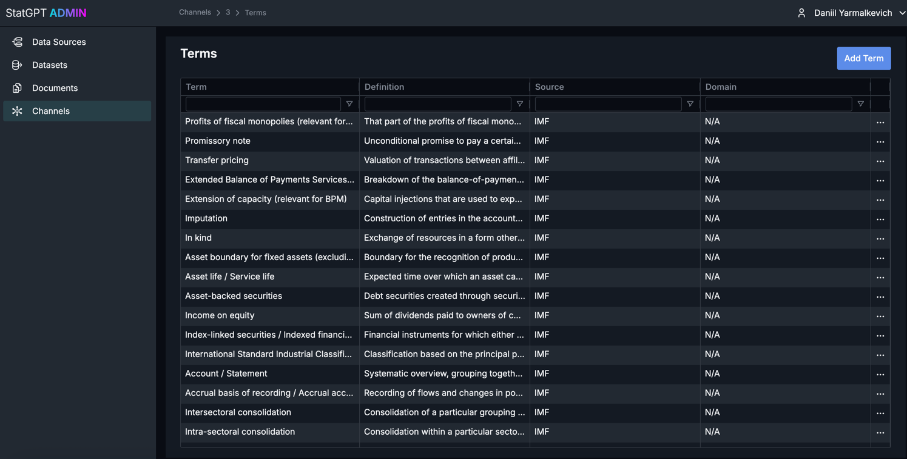

There you can add and edit terms:

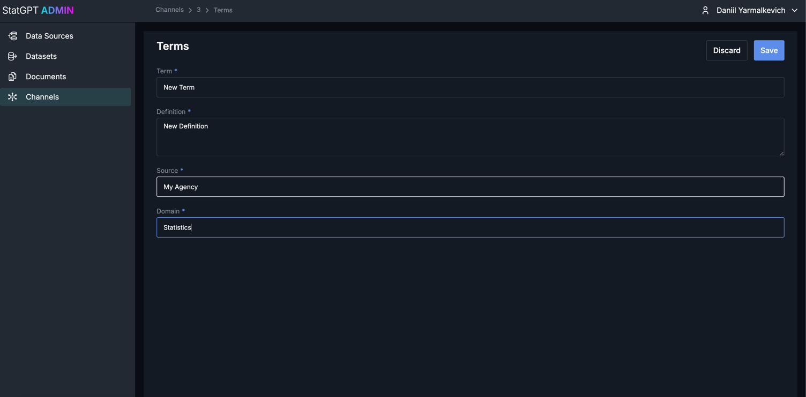

Delete terms:

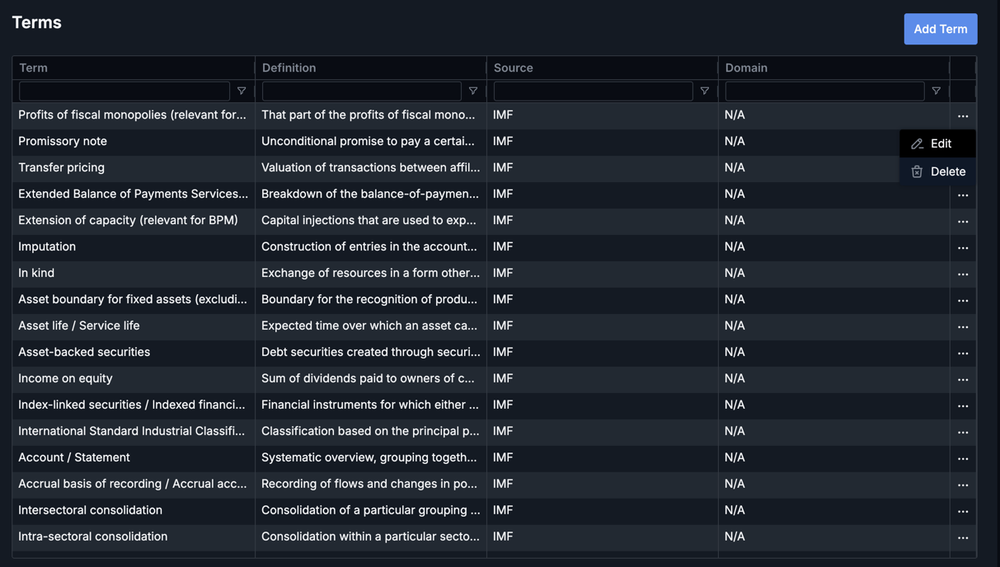

### Reindexing

StatGPT relies on different search strategies that require indexing dataset metadata. You can see each dataset's
indexing status in the "Status" column. The following status options exist:

1. `Queued` - Dataset is waiting in the queue for the indexing job to start.
2. `In progress` - Indexing job is currently running.
3. `Finished` - Dataset was successfully indexed.
4. `Failed` - Dataset indexing job failed and requires either reconfiguration or a simple retry.

You can run reindexing for a specific dataset in the channel:

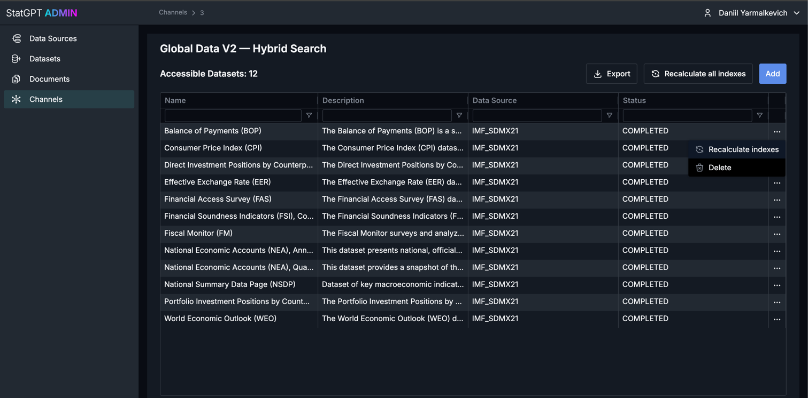

You can also run reindexing for all datasets in the channel:

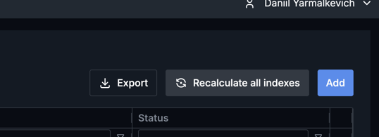

### Import/Export & Jobs

Import/Export functionality allows you to download and upload channel dumps with their configurations and
indexes. When exporting or importing a channel, a dedicated job will be created. Jobs linked to the channel can be
reviewed on the Jobs page, where related artifacts can also be downloaded.

You can export a specific channel by clicking the "Export" button in the channel context menu.

You can import a channel by clicking the "Import" button on the channels list page:


The import menu has the following toggles:

1. `Remove channel with the same id` - If enabled, any existing channel with the same ID will be removed before
   importing
   the new one. If disabled, the import will fail if a channel with the same ID already exists.
2. `Update datasets` - If enabled, datasets will be updated to the version in the import file. If disabled, existing
   datasets will not be updated.
3. `Update data sources` - If enabled, data sources will be updated to the version in the import file. If disabled,
   existing data sources will not be updated.

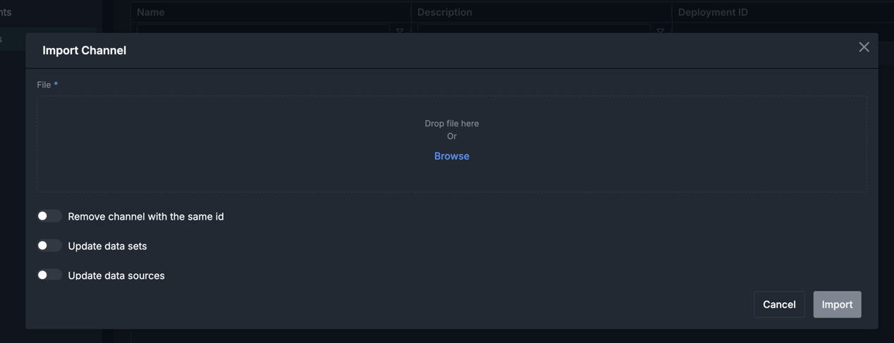

After starting either import or export, a new job will appear in the corresponding channel's jobs list, which can be
accessed by clicking the "Jobs" button in the channel menu:

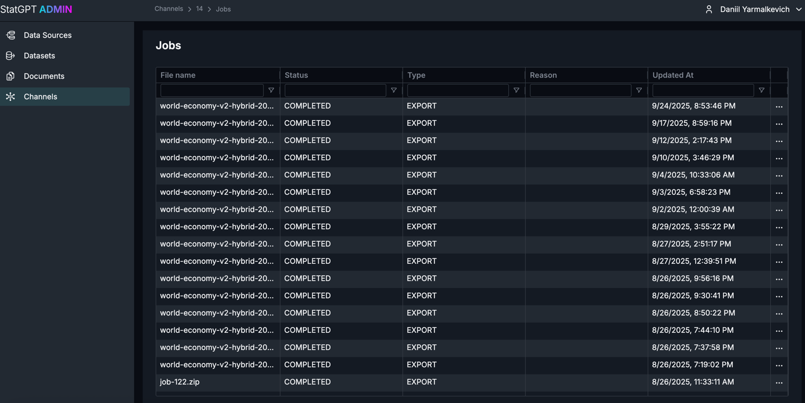

The Jobs page allows you to review jobs related to the channel, their status, and download related artifacts:

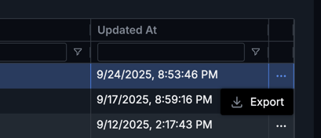
