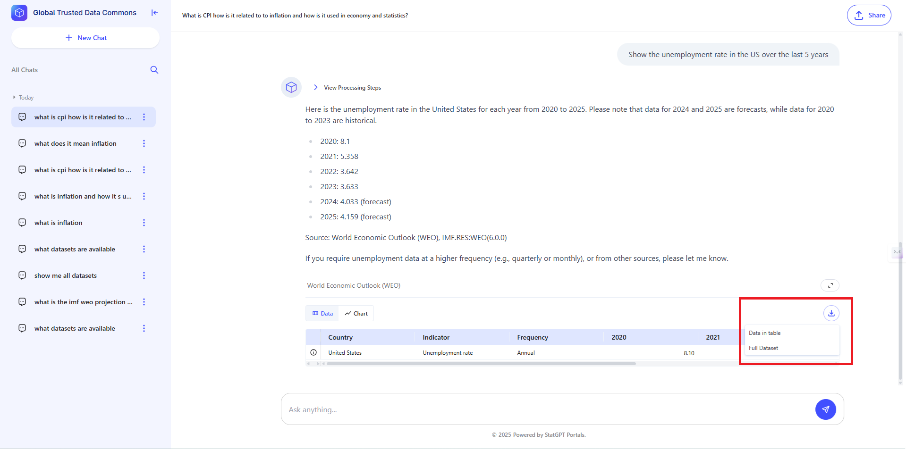

# GTDC Portal User Guide

## Overview

The GTDC Portal is an intelligent agent specializing in statistics, economics, and the SDMX standard.

## Table of Contents

- [Getting Started](#getting-started)
- [Interface Components](#interface-components)
    - [Block 1: Start New Chat](#block-1-start-new-chat)
    - [Block 2: Search](#block-2-search)
    - [Block 3: Dialogue List/History](#block-3-dialogue-listhistory)
    - [Block 4: Question Input](#block-4-question-input)
    - [Block 5: Suggested Questions](#block-5-suggested-questions)
    - [Additional Interface Features](#additional-interface-features)
- [Using the Portal](#using-the-portal)
    - [Example Queries](#example-queries)
    - [Page Elements](#page-elements)
- [Advanced View](#advanced-view)

## Getting Started

Access the portal at: <https://portal-stg.statgpt.org/>

### Hero Section

## Interface Components

The first screen contains five main blocks:

1. **Start New Chat** - Button to initiate a new conversation (typically located in the top section)
2. **Search** - Field for navigating through dialogues or documents
3. **Dialogue List/History** - List of previous conversations ordered by date, allowing you to reopen and continue past
   dialogues
4. **Question Input** - Main input field where you enter your request or question
5. **Suggested Questions** - Predefined example queries to help you quickly start a dialogue or learn how to formulate
   requests

## Detailed Component Descriptions

### Block 1: Start New Chat

To create a conversation, click the **+ New Chat** button.

### Block 2: Search

Search by title, tags, or author to locate anything from your previous dialogues. After selecting the desired item, you
will be redirected to the corresponding dialogue.

### Block 3: Dialogue List/History

Displays recent conversations with the assistant, including the last update date and a short preview of the latest
message.

**Conversation Actions** (click the three dots next to the dialogue):

- Open
- Share
- Export (JSON)
- Delete

### Block 4: Question Input

Formulate your requests clearly and specifically. Specify the indicator of interest, the country (or group of
countries), the time period, and other relevant details.

### Block 5: Suggested Questions

Predefined questions and topics that the AI suggests for exploration.

### Additional Interface Features

You can collapse and restore the sidebar for a cleaner interface.

## Using the Portal

### Example Queries

- "What is 'inflation'?"
- "Show the unemployment rate in the US over the last 5 years."

By asking "What is 'inflation'?", you receive a detailed definition and explanation of the term, including its meaning,
use in economics, and different types of measurement.

**Practical Example:**

**Query:** "Show the unemployment rate in the US over the last 5 years."

**Result:** The system returns a dataset with unemployment rates for the specified period, along with the source
reference.

### Page Elements

**Share**

Provides options to share the retrieved data or visualization (e.g., via link, QR code).

**View Processing Steps**

Displays the sequence of operations applied to the data (e.g., filtering, aggregation, formatting). Helps track how the
final result was generated.

**Source**

Indicates the origin of the dataset or definition (e.g., IMF, World Bank, OECD). Used for data verification and
reliability.

**World Economic Outlook (WEO)**

Specific source reference — the IMF's World Economic Outlook database. Provides official macroeconomic statistics.

**URL**

Clickable link to the original dataset or documentation page. Allows direct access to the source system.

**Data**

The numerical/statistical information returned by the query. Usually displayed in tabular format for clarity.

**Chart**

A graphical representation of the retrieved data (line chart, bar chart, etc.) for easier interpretation.

**Advanced View**

An extended mode for interacting with the dataset. May include additional filters, export options, or alternative
visualizations.

**Download**

Allows you to save the retrieved data or visualization locally.

**Share**

Provides options to share the retrieved data or visualization (e.g., via link, QR code).

**Data**

Displays the indicators according to the selected criteria.

**Chart**

Displays the selected indicators on a time scale, providing a visual representation of data dynamics over the chosen
period.

**Download**

Allows you to save the retrieved data or visualization locally.

When clicking the Download button, you can choose:

- **Data in table** - Only the currently displayed table data
- **Full dataset** - The complete dataset from the source

**Data Format Options:**

- SDMX-JSON
- SDMX-ML (XML)
- SDMX-CSV

**Attribute Options:**

- **ID** - File will include only the ID column
- **ID and Name** - File will include ID and NAME in separate columns
- **Combined ID and Name** - File will include one column with ID and NAME combined as ID:Name

**Metadata:**

- Toggle option to include or exclude metadata in the file

## Advanced View

In Advanced View, you can:

- View dataset information, including the last update date
- Share or download the data
- Apply filters directly to the dataset

Example filters:

- **Country** - United States
- **Indicator** - Unemployment rate
- **Time period** - Jan 1, 2020 - Dec 31, 2025

These filters can be modified as needed.

To change the country:

1. Click on the country parameter
2. Select one or multiple options by checking the boxes
3. Use the search field to find specific countries

You can also change or add indicators of interest.

You can select the frequency. Only options available for the current selection will be displayed (e.g., Annual).

Time Period options:

- All years
- 5 years
- 10 years
- 20 years
- Custom period - specify the exact time range

After adjusting filters, you can:

- Click **Apply** to apply the changes
- Clear all filters
- Cancel the actions

The result will be an updated dataset with your modified filters applied.

### Example: Multiple Dataset Options

**Query:** "Give me the data on Japan's government debt for 2023."

When multiple datasets are available, the agent will ask for clarification:

**Agent Response:**
"There are two relevant datasets available for Japan's government debt in 2023:

- Government debt as a percent of GDP and in domestic currency (WEO)
- Detailed portfolio investment in government debt securities (BOP)

Please specify your preference. If unsure, the World Economic Outlook (WEO) dataset is recommended for a general
overview."

**User Selection:** "Detailed portfolio investment in government debt securities (BOP)"

**Agent Follow-up:**
"To provide detailed data on Japan's portfolio investment in government debt securities for 2023, please specify the
counterpart country or countries (where Japan holds these investment positions). For example: United States, Germany,
China, or all available countries."

You can then specify countries to refine your query.

### Working with Advanced View Filters

