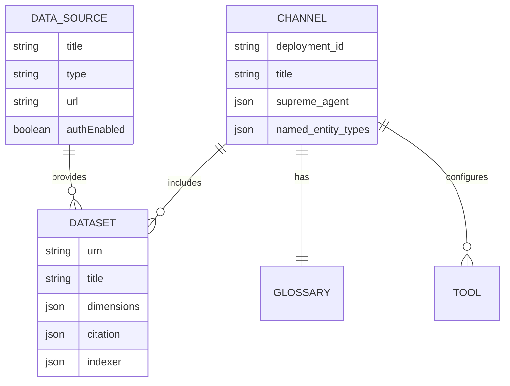

# Module 01: Core Concepts & Entity Relationships

## What You'll Learn

- What StatGPT is and how it works at a high level
- What users see when they interact with StatGPT
- The three core entities: Data Source, Dataset, and Channel
- How these entities relate to each other
- How the Admin UI maps to these entities
- What SDMX is and why it matters for StatGPT
- Key SDMX terms every admin needs to know

---

## What is StatGPT?

StatGPT is an AI-driven Talk-To-Your-Data platform that enables users to interact with official statistics data using
natural language. Instead of writing database queries or navigating complex data portals, users simply ask questions
like *"What was the GDP of Germany in 2023?"* and StatGPT retrieves the relevant data from statistical databases,
presents it in tables, and generates visualizations.

StatGPT combines large language models (LLMs) with structured SDMX metadata to translate natural language questions into
precise data queries. All responses are grounded in actual data — the system is designed to prevent hallucination by
citing sources and using exact values from query results.

### What Users Experience

StatGPT presents a **conversational chat interface** — not a search box or a data portal. Users type natural language
questions and receive structured responses that include:

- **Data tables** with columns for dimensions, values, and attributes
- **Interactive charts** showed along with the data tables for visual insights
- **Citations** that reference the exact dataset, data source, and time period
- **Exact values** from query results — never approximated or hallucinated

Users can start conversations using **conversation starters** — predefined example questions that appear in the chat
interface. From there, they can ask follow-up questions in **multi-turn conversations**, refining their queries or
exploring related data.

As an admin, you configure which datasets feed these answers, what columns appear in tables, what conversation starters
users see, and how the agent behaves. Every configuration choice you make directly affects what users experience.

## The Three Core Entities

StatGPT's configuration revolves around three core entities that you'll work with as an administrator:

### Data Source

A **Data Source** is a connection to an external statistical data provider that exposes data via the SDMX protocol.
Examples include:

- **IMF** — International Monetary Fund (SDMX 2.1 API)
- **Eurostat** — Statistical office of the European Union
- **World Bank** — World Development Indicators
- **ECB** — European Central Bank
- **BIS** — Bank for International Settlements

A Data Source defines *how* StatGPT connects to the provider: the API URL, authentication settings, supported SDMX
features, and request headers.

### Dataset

A **Dataset** is a direct representation of an SDMX dataflow within a Data Source, combined with StatGPT-specific
configuration. For example, the IMF Data Source contains many datasets:

- **IMF.RES:WEO** — World Economic Outlook (macroeconomic projections)
- **IMF.STA:CPI** — Consumer Price Index
- **IMF.STA:BOP** — Balance of Payments
- **IMF.STA:EER** — Effective Exchange Rates

Each dataset has its own configuration that tells StatGPT how to interpret the dataset's dimensions, what to index, how
to cite the data, and more. This is where the bulk of onboarding work happens.

### Channel

A **Channel** is a deployment of the StatGPT application for end users. Each channel has:

- Its own set of linked datasets
- Agent configuration (LLM model, behavior instructions, domain)
- Named Entity types for dimension recognition
- Conversation starters for the chat interface
- A glossary of terms

Having multiple channels allows experimentation with different configurations, or serving different user groups with
tailored dataset selections. Each channel is exposed as a separate application in the DIAL platform.

### The Admin UI

> **StatGPT Admin** is a web application — you do not edit configuration files directly. The Admin UI has three main
> tabs that correspond to the three core entities: **Data Sources**, **Datasets**, and **Channels**.

The typical workflow in the Admin UI follows this order:

1. **Create a Data Source** — configure the connection to an SDMX provider
2. **Add Datasets** — select dataflows from the Data Source and configure them
3. **Create a Channel** — set up the user-facing deployment
4. **Link Datasets to the Channel** — choose which datasets this channel can query
5. **Index the Channel** — build the search index so the agent can find data

The YAML-like configurations shown in later modules (Modules 04-05) correspond to form fields in the Admin UI, not files
you edit manually. When you see a configuration example, it maps to a specific section of the web interface.

For detailed walkthroughs, see [Module 04 — Dataset Configuration](04-dataset-configuration.md)
and [Module 05 — Data Sources & Channels](05-data-sources-and-channels.md).

## Entity Relationships

The key relationships:

- A **Data Source** can have many **Datasets** (one-to-many)
- A **Channel** can include many **Datasets** (many-to-many)
- A **Dataset** belongs to exactly one **Data Source** but can appear in multiple **Channels**
- Each **Channel** has its own agent configuration, glossary, and tool settings

### Tools

The diagram shows that a Channel configures **Tools**. These are the capabilities the agent can invoke when answering
user questions:

| Tool                   | Purpose                                             |
|------------------------|-----------------------------------------------------|
| **Query Data**         | Build and execute SDMX queries to fetch actual data |
| **Available Datasets** | List which datasets are available in the channel    |
| **Available Terms**    | List glossary terms the agent can reference         |
| **Term Definitions**   | Retrieve definitions for specific glossary terms    |

Admins configure tool behavior per channel — for example, adjusting how the data query tool selects indicators or how
many results it returns. Tool configuration is covered in detail in [Module 05](05-data-sources-and-channels.md).

### Practical Example: An IMF Channel

A channel configured for IMF data would connect to an IMF SDMX data source and include datasets like WEO, BOP, CPI, EER,
and others. The channel's agent would be configured as "StatGPT" with a domain of "Statistics, economics and SDMX" and
use an LLM like GPT-4.1 as the underlying model.

## Introduction to SDMX

### What is SDMX?

**SDMX** (Statistical Data and Metadata eXchange) is an international standard for exchanging statistical data and
metadata. It provides a common vocabulary and structure that statistical organizations worldwide use to publish their
data.

Why SDMX matters for your work as an admin:

1. **It's your configuration language** — every dataset configuration you write maps directly to SDMX concepts (
   dimensions, code lists, attributes). Understanding SDMX means understanding what you're configuring.
2. **It determines what's searchable** — code lists (the lists of allowed values for dimensions) become the search index
   that the agent uses to find relevant data. If a code list is poorly labeled, users won't find what they need.
3. **It controls data accuracy** — the Data Structure Definition (DSD) defines what dimensions and values exist. StatGPT
   uses this to construct valid queries and verify data availability.
4. **It structures the responses** — dimensions and attributes from the SDMX metadata determine what columns appear in
   data tables and what citation information is available.

You don't need to become an SDMX expert, but you need the core concepts below to configure datasets effectively.

### Key SDMX Terms for Admins

| Term                                | Definition                                                                                                     | Why It Matters                                                                                                                  | What You Configure                                                                                                   |
|-------------------------------------|----------------------------------------------------------------------------------------------------------------|---------------------------------------------------------------------------------------------------------------------------------|----------------------------------------------------------------------------------------------------------------------|
| **Dataflow**                        | A published dataset available for querying. Identified by agency, ID, and version (e.g., `IMF.STA:CPI(5.0.0)`) | Each StatGPT dataset corresponds to one SDMX dataflow                                                                           | You select which dataflow when adding a dataset in the Admin UI                                                      |
| **Data Structure Definition (DSD)** | Defines the structure of a dataflow — its dimensions, attributes, and measures                                 | StatGPT uses the DSD to understand what dimensions exist and what values they can take                                          | You specify which dimensions are indicators vs. non-indicators — see [Module 03a](03a-dimension-types.md)          |
| **Dimension**                       | A structural component that identifies data points (e.g., COUNTRY, INDICATOR, TIME_PERIOD)                     | Dimension types (INDICATOR, NON_INDICATOR, TIME_PERIOD) are configured per dataset — see [Module 03a](03a-dimension-types.md) | You classify dimensions as INDICATOR, NON_INDICATOR, or TIME_PERIOD — see [Module 03a](03a-dimension-types.md)     |
| **Code List**                       | An enumerated list of allowed values for a dimension (e.g., country codes, indicator codes)                    | Code list quality directly affects search accuracy — see [Module 02](02-dataset-assessment.md)                                | StatGPT indexes these; you configure how indicators are indexed — see [Module 03b](03b-indicator-configuration.md) |
| **Attribute**                       | Additional information attached to data (e.g., UNIT, SCALE, SOURCE)                                            | Some attributes are included in the agent context via `includeAttributes`                                                       | You select which attributes appear in query results — see [Module 04](04-dataset-configuration.md)                 |
| **URN**                             | Unique Resource Name — the unique identifier for a dataflow (e.g., `IMF.RES:WEO(9.0.0)`)                       | Used in dataset configuration to link to the correct SDMX dataflow                                                              | Pre-filled when you select a dataflow in the dataset wizard                                                          |
| **Concept Scheme**                  | A collection of related concepts used across datasets                                                          | Helps understand what dimensions represent                                                                                      | You don't configure this directly — it's used internally by StatGPT                                                  |

> **Metadata Quality Warning**
>
> Not all SDMX datasets are ready to onboard. Watch for these signs:
>
> **Red flags** (will cause problems):
> - Duplicate or generic code list names (e.g., multiple dimensions with labels like "Code" or "Value")
> - Missing English labels on code list items
> - Slow or unreliable API responses
> - Vague dimension IDs that don't indicate their purpose
>
> **Green flags** (ready to onboard):
> - Unique, descriptive names for all code list items
> - English localization present across dimensions and attributes
> - Fast, reliable API with consistent response times
>
> For the full assessment methodology, see [Module 02 — Assessing Datasets for Onboarding](02-dataset-assessment.md).

### How StatGPT Uses SDMX

When a user asks a question, StatGPT's Data Query tool follows this pipeline:

1. **Query Normalization** — Processes the natural language input
    - *Your role:* Ensure dataset metadata uses clear, standard terminology so the LLM can interpret queries correctly
2. **Named Entity Recognition** — Extracts countries, time periods, and other known entities
    - *Your role:* Configure Named Entity types in the channel configuration —
      see [Module 05](05-data-sources-and-channels.md)
3. **Indicator Selection** — Uses semantic and keyword search over indexed code list items to find relevant indicators
    - *Your role:* Configure indexer settings and dimension types so the right indicators are indexed —
      see [Modules 02](02-dataset-assessment.md)-[03a](03a-dimension-types.md)
4. **Dataset Selection** — Identifies which dataset(s) contain the requested data
    - *Your role:* Write clear dataset descriptions and link appropriate datasets to channels —
      see [Module 04](04-dataset-configuration.md)
5. **Availability Queries** — Verifies that data exists for the requested combination of dimensions
    - *Your role:* Assess data completeness during onboarding — see [Module 02](02-dataset-assessment.md)
6. **Query Execution** — Fetches and formats the SDMX data
    - *Your role:* Configure which columns and attributes appear in query results —
      see [Module 04](04-dataset-configuration.md)

The accuracy of each step depends on the quality of the underlying SDMX metadata and how well the dataset is configured
in StatGPT.

## Check Your Understanding

Test your grasp of the core concepts before moving on.

<strong>1. A colleague asks you to add a new World Bank dataset to StatGPT. What three entities do you need to set up, and in what order?</strong>

**Answer:** Data Source (World Bank SDMX API), Dataset (the specific dataflow), then link it to a Channel. The Data
Source defines the connection, the Dataset configures how StatGPT interprets the data, and the Channel makes it
available to users.

<strong>2. A user reports that StatGPT can't find data about "inflation in France." Which SDMX concept is most likely involved in finding the right indicator?</strong>

**Answer:** Code List — the indicator code list must contain an item that semantically matches "inflation" (e.g., a CPI
indicator). The indexer searches code list items to map natural language terms to specific indicators.

<strong>3. You're told the IMF has released a new version of the CPI dataset (version 6.0.0, up from 5.0.0). Which StatGPT entity needs updating?</strong>

**Answer:** It depends on how the Dataset is configured. If the dataset uses `version: "latest"` (recommended), no
manual update is needed — the system automatically tracks the current published version, and
[auto-update](06-indexing-and-operations.md#auto-update) detects the new version and reindexes if needed. If a pinned
version is used (e.g., `"5.0.0"`), you need to update the URN in the Dataset configuration to `"6.0.0"`.

<strong>4. What is the difference between a Data Source and a Dataset?</strong>

**Answer:** A Data Source is the connection to a provider's API (e.g., the IMF SDMX endpoint). A Dataset is a specific
dataflow within that source (e.g., CPI) plus StatGPT configuration for how to interpret and index it. One Data Source
has many Datasets.

<strong>5. You want to test a new LLM model for answering queries. Do you need to create new Datasets, a new Channel, or both?</strong>

**Answer:** A new Channel. Channels have their own agent/LLM configuration. You can link the same Datasets to the new
Channel without reconfiguring them.

<strong>6. Why does StatGPT require SDMX-format data sources rather than generic CSV files or databases?</strong>

**Answer:** SDMX provides structured metadata (dimensions, code lists, attributes) that StatGPT uses to understand
dataset structure, build search indexes, and construct valid queries. Without this structure, the system couldn't
automatically map natural language to the right data.

## Key Takeaways

- StatGPT presents a **conversational chat interface** where users get data tables, charts, and cited responses
- Three core entities: **Data Source** (connection), **Dataset** (configured dataflow), and **Channel** (user-facing
  deployment)
- You manage all three entities through the **Admin UI** web application — not config files
- A Data Source can have many Datasets; a Channel includes many Datasets
- Understanding basic SDMX concepts (dataflow, DSD, dimension, code list) is essential — they map directly to what you
  configure
- The quality of SDMX metadata directly impacts how well StatGPT answers user queries
- Not all datasets are ready to onboard — assess metadata quality before investing configuration effort

---

**Next:** [Module 02 — Assessing Datasets for Onboarding](02-dataset-assessment.md)
